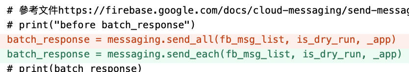
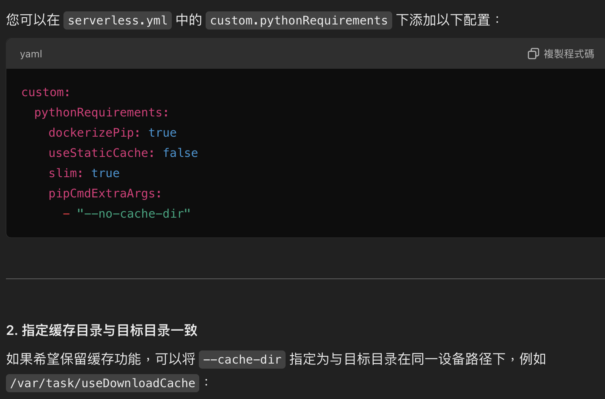
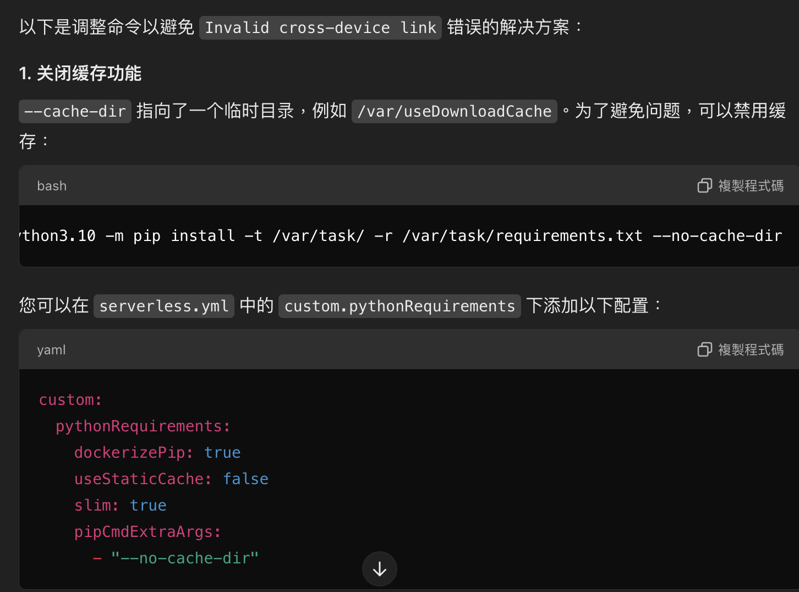
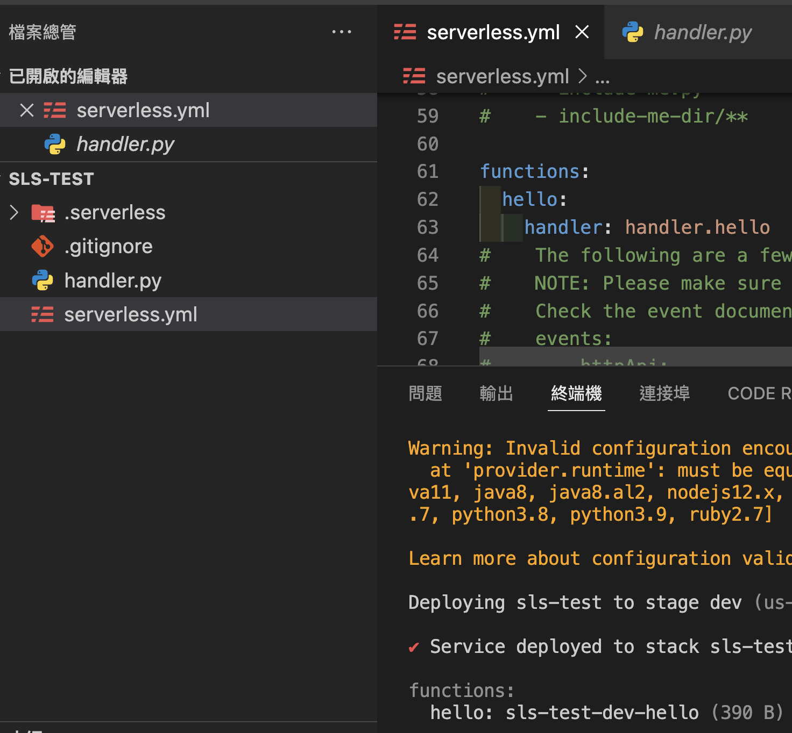
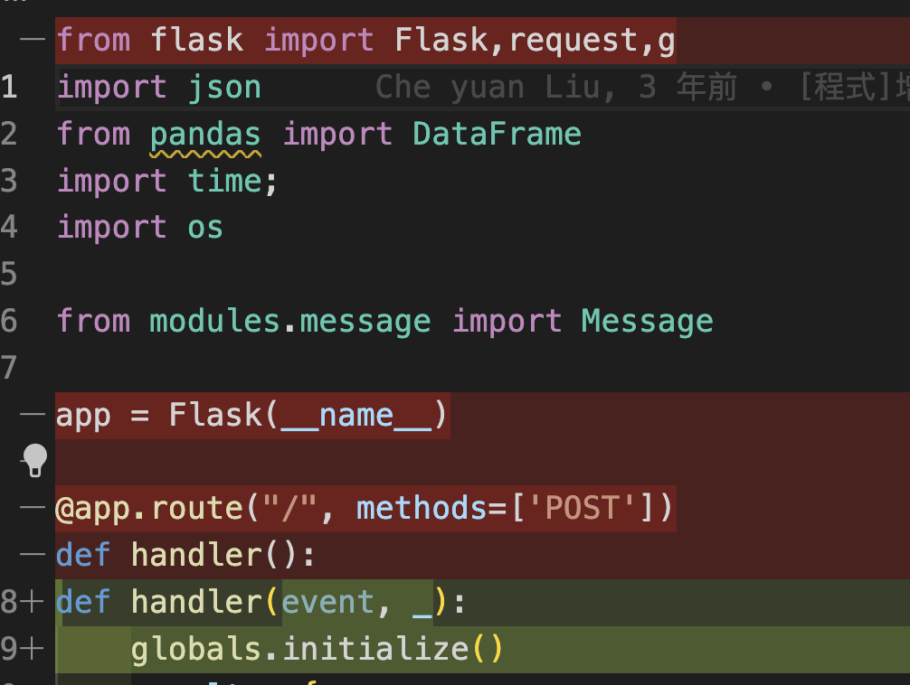
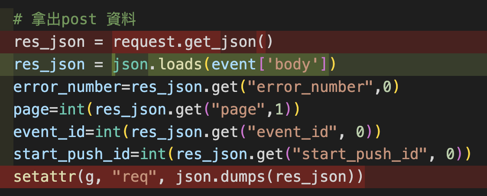
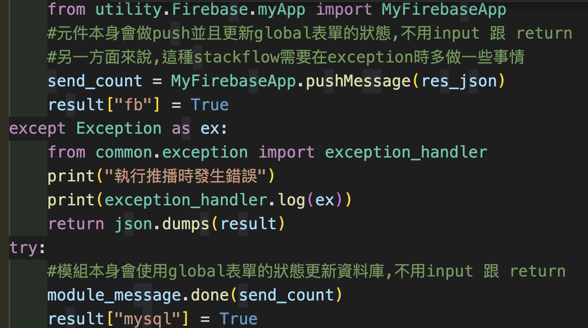
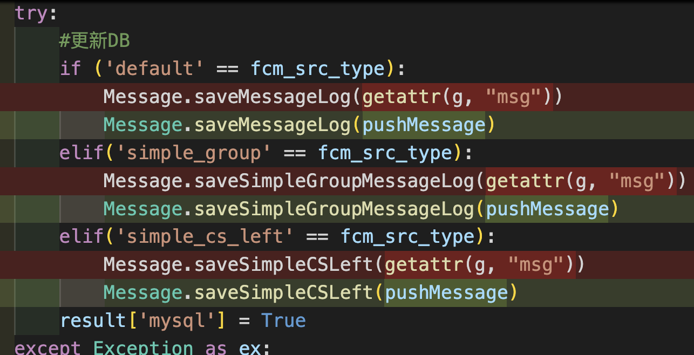
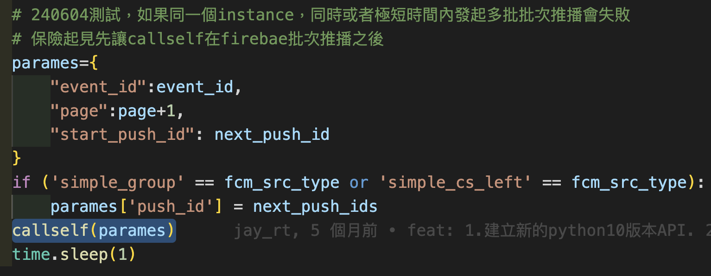
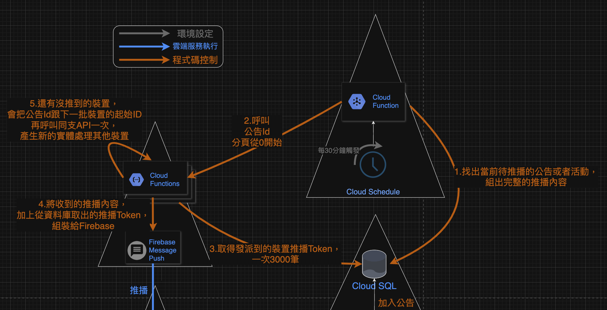

## Ｗhat was that?
剛來到第二間公司的時候，公司在設定客戶上面臨一個問題，那幾年剛好是線下客戶轉線上的活躍年代，很多企業都想要用網路來觸及或者維持客戶關係，但這樣的需求導致，系統Load Balance、Auto Scale乃至於24/365的需求變高了，例如客戶營業時間，消費者會相對活躍，但下班後基本沒有流量；甚至要應付大量推播、搶購等情境。

那個時候我對於Ops還沒有什麼經驗，自以為Serverless是那個萬無一失的解方，簡單地說，雲端方會負責機器的運作，開發者只要部署程式上去，理論上就會得到一個隨需支付、服務等級與AWS、GCP同等級的服務。然而事情遠沒有那麼簡單，這個架構導致的結果是，當服務真的變慢、甚至下線(對消費者端來說持續loading或500)，很難追查出問題的環節，因為我能掌握的就只有程式碼而已。

另外一點是，那幾年聲量大漲的python，讓身邊的同事比較傾向python而不是node，然而這個選型在技術上是個頗錯誤的決定，JS這個瀏覽器上的釘子戶，隨著雲平台、Docker等技術降低了後端開發、維運等門檻後，反過來讓後端生態系不得不面對各種JS的工具或者微服務，如Amplify的後端開發目前也僅有Node一途。

總而言之，當年我找到名為Serverless Framework的工具，可以用來代理跨雲平台(AWS、GCP乃至於Azure)的部署，對於偏重程式語言，腳本能力薄弱的我，這一切都如此水到渠成，也確實透過Serverless(Lambda、Cloud Run、Cloud Function等)，讓團隊在編制沒有正職系統架構師、MIS、SRE......等等的情況下，把原本一天都推不完的全體推播，縮短到半個小時內，事實上，在大型專案的驗證，預估15分鐘左右就可以處理兩百萬筆單純的推播(複雜的如訂餐、取餐通知，個人生日優惠等)，也扛住了一定程度的搶購量(約500QPS)。而上線後2~3年間，大致上也都沒有變更這些服務的程式碼。

## the Exception
由於我們疏於關注文件，沒注意到Firebase在2024年，將原來推播的使用的api，send_all改為send_each，這一個小小的變動，一連串反應觸發我職涯的危機意識。那是一個下班前約一個小時，PM回報客戶沒收到推播，經過追查後端在發送訊息後收到400錯誤，很幸運地我在下班前就找到了在文件中被藏得有點深的send_each，改動完以後IDE沒有任何毛毛蟲，似乎可以順利下班了。然而在一如過去幾年--事實上在此的兩三個月前我還在幫同事開新的推播API--下Serverless Framework的指令 *sls deploy*

原本以為這樣就下班了


卻看到令人心涼的錯誤


錯誤中顯示兩件原本我不知道的事情，一是我以為很單純的推程式碼到lambda，其實包括了安裝、甚至編譯等動作，二是Sls Framework默默地用了Docker。另外一個一直知道的隱患是，Sls Framework其實是基於NodeJS的工具，而程式碼是以python開發的。所以這段錯誤牽涉到四個黑盒子：編譯出Lambda真正執行的程式碼發生錯誤、使用AWS CLI的時候錯誤、啟用Node環境錯誤或者啟用Docker錯誤。

幸運的是：
- 24年初aws剛宣布lambda不再支援python3.8以下，我剛把機器環境跟專案的版本都升上3.10，並開新的API給同事，確認相安無事，Lambda與AWS CLI在之後也持續運作正常。
- 在本機執行sls wsgi serve，仍然能夠啟動專案，並且執行API。

那麼矛頭基本可以指向預期外的Docker這段了，推測Sls Framework類似於我用Docker來確保開發或者編譯環境的做法，但有一天遇到了node:latest版本，在Ｍ1晶片安裝或者執行失敗的坑，畢竟實際上兩三個月前我才開部署過最新的API，這個流程中所有我的控制變因都沒有改變，問題大概就在不是我控制的變數了。然而這個狀況麻煩在於

- 我不知道Sls Framework啟動了Docker/NodeJS環境做什麼事情，如果知道的話自己在機器上下指令，最後結果交給sls或AWS CLI部署就好
- 也不知道最後一個能在M1上運作並且執行python工作的是Node的哪個版本

### **如果當初我的開發環境，也是基於固定的python以及Node版本就好了**
這件事情發生之前，還能跟同事像是分享軼事或個人成長，討論固定開發環境的想法，但這起意外卻是勢必要處理的情境，而且偏偏就在下班準點的那一刻.....

但眼前目標已經縮小到跟Docker、Node有關的部分，很幸運的是Sls Framework是一個蠻負責的框架，仔細看那一片嚇人的錯誤訊息，剛好有我臆測的關鍵字*latest*
> Error:
Running "docker run --rm -v /Users/cheyuanliu/Library/Caches/serverless-python-requirements/6d410d184b0a03963a8f7b538418f3523e469ffb67e2dde075b32fafe569fdbb_x86_64_slspyc:/var/task:z -v /Users/cheyuanliu/Library/Caches/serverless-python-requirements/downloadCacheslspyc:/var/useDownloadCache:z -u 0 public.ecr.aws/sam/build-python3.10:latest-x86_64 python3.10 -m pip install -t /var/task/ -r /var/task/requirements.txt --cache-dir /var/useDownloadCache" 

而DevOps同事也剛講過docker registry/ecr等工具，這個被Sls Framework拿來用的docker image，是AWS供應部屬Lambda的環境之一， **public.ecr.aws/sam/build-python3.10:latest-x86_64** 也應證了猜測，基本上是:latest標籤造成的問題，尋尋覓覓之下，找到了在此之前最有可能部署成功的版本 **public.ecr.aws/sam/build-python3.10:1.120.0-20240626164104-x86_64**，於是我模仿自己重現開發環境的手法，把專案mount到該環境，自己下一次 *python3.10 -m pip install -t /var/task/ -r /var/task/requirements.txt --cache-dir /var/useDownloadCache* ，然後，依然出現關於permission的error。

接下來了ChatGPT，查了Google、StackFlow、Github的issue，套件升級了、DockerHub切到gRPC FUSE，依照同事說法下*pip install --use*，依照GPT的說法試了各種SLS的yaml組合都無效，但GPT的說法提供了個想法--也許不依靠serverless-python-requirements就好--

已經晚上九點多了，根據GPT的各種提示，似乎問題是在requirements-python這個套件身上




於是試著開一個新的資料夾，安裝sls framework，python沒有裝任何requirements，直接 *sls deploy*

雖然這是為了寫文件的事後畫面，竟然成功部署了


## again, why lambda, and what's serverless( framework)
至此，需要回頭說說Lambda這個服務，以及Serverless Framework這個工具做了什麼。
前面有稍微提過，對公司這樣的中小型團隊，每個工程師都得身兼多職，但不見得專業，公司卻渴望在接案紅海中取得一定的案源。因此寄生在AWS的服務下，代替Ops/SRE的人力是無可厚非的，Lambda就成為了實現推播、搶購等場景的解決方案，但是在我進入公司並且主張Serverless Framework這個觀念的時候，團隊正好面臨了
1. 原本用AWS，客戶用GCP的場景
2. 團隊其他人熟悉的PHP在那個時候沒辦法部署到Lambda和Cloud Function
另外，我有點驚訝於不是每個後端，或者server-client模式的開發者，都習慣於處理不一樣的http接口，而偏Lambda作為一種AWS內部泛用的規格，都不是常見的request、response，而是直接處理Context的風格

一般的Web框架會封裝明確的Request和Response，以及方便的路由或者入口點

[!flaskEntryPoint](md_resources/p9.png)

Lambda作為一個可接各種Schema的FaaS，開發者需要直接面對文本(Context)

[!Lambda](md_resources/p10.png)

應該是Lambda官方在那時候也有建議以Serverless Framework作為解決方案，不擅長使用腳本、AWS CLI等工具的我也就選擇了它來代理工作，因為除了前述解決我不擅長使用腳本工具以外，**sls framework在過程中，也會幫忙轉譯context=>request, response**這一段，讓開發者可以保持自己習慣的Web Server Framework開發，實際上，現在我回頭看這個路線也是正確的，畢竟現在有太多輪子在他們的生態系活躍，不需要開發者去重造，這些案例往後的文章(記得的話)都會提到[^1]。

那麼，serverless-requirements-python沒辦法使用的情況下，意味著我們不能指望工具來處理接口這個問題了，而且時間已經超過晚上9點，而明天早上10點後，客戶的推播理論上就需要恢復，我有兩個選擇：
1. 找個同事幫忙，整個環境安裝一遍，看看是不是M晶片在搞鬼，然後部署一版用Firebase新的推播API。
2. 做一次主管自己打破規矩的壞案例，在不通知團隊潛在風險的情況下加班拼一個沒有Flask的版本。

我選擇了後者，於是，本文這才正式開始

## what would need to be revised?
前面說過，Web Server Framework可以給開發者帶來很多方便，現在的開發者比較難以察覺的案例是前述的Request、Response。Flask-SQLalchemy就會是一個相對有體感的反例，如果專案中用了這個lib，臨時要拆掉Flask就會多點麻煩，還好，那時候的我鐵齒沒有用......，應該說整個專案，用Flask只是寄望於同事比較好懂而已，其他都是因為本身的完整性，而不是跟框架整合的插件，那麼我們要改的地方就不多了，也藉此複習一下當時慘烈的、不符合Meta的專案結構

Bye Bye，簡潔的mid/router，還有global


其實Lambda的介面也整理得很整潔了


註記一下 *setattr(g, "req", json.dumps(res_json))* ，當年的想法是，(Http)Controller、DB Services與 FCM Services之間互相不用參數傳遞，而是向global取一個不訂欄位的Schema(巢狀的dict或者Table)，各自在自己的範圍試著取出需要的內容，若驗證失敗就直接throw，期望用這樣的方式解耦。所以沒有global可用的情況下，其實整份程式碼最大的改變在於現在必須把複雜的結構，在物件或者mehtod之間傳遞、轉換，幸好**python終究是個弱型別語言**，不用面對定義Input/Output的Schema問題。

這邊前同事為了追蹤資料，把panda.DataFrame這種複雜的結構直接做傳遞了，所以附上原作的圖





其實到這邊已經重寫的差不多了，印象中當時查了一下Lambda的文件、確定還是有global使用，所以很快就「修改完」，進入測試、打包然後部署的階段。一方面也因為推播元件是非常簡單的工作、Lambda也幾乎可以保證一個instance指處理一個請求(Cloud Function才能這樣設定)，所以敢大膽地用global作為每個Services溝通的媒介，以及python弱型別的特性省去修改Schema的麻煩。

最後提一下，這個機制實現大量推播的核心--callself--機制



原本公司前輩寫的邏輯是，每分鐘會有排程掃描待推播的訊息(PushId = 公告ID + 裝置Token)，每次處理一定數量(疑似300筆)並且在資料庫存下firebase的回傳結果，因此推播的瓶頸是可以預期的。我的想法其實也很簡單暴力，把這個基數拉高或者頻率變高就好，因為觀察起來推播工作並沒有耗到太多效能，但那個時候，團隊都還用自己架站在EC2裡面，不管是在PHP增加用多執行緒處理、在Linux用MQTT之類的，都不是太有意願，最後採用了Serverless的提議，流程也略改為
1. 排程觸發PHP
2. PHP掃描所有推播時間已到的公告ID，分別呼叫Servreless提供的API，此時裝置ID為0或null
3. 在Serverless會以裝置ID(by auto increment)做sort和offset，每次拿3001筆資料出來
4. 如果確實有3001筆資料，將公告ID與第3001個裝置ID做為參數再呼叫自己一次，然後進行推播、更新推播結果
5. 遞迴會持續到搜出的裝置少於3001筆為止
後來這個機制從掃描、API內容還有很多變形，以應付推播內容不是來自Table的需求、需要掃描來自後台的每一筆客製化訊息，訊息多到不能丟Table要丟額外的quebe服務等等，但核心概念都是
> 把業務邏輯做分類，然後設計專門為這一類存在的FaaS，並且讓每個遞迴自生自滅



### 感謝身邊的人，包括自己
回頭看，其實蠻感謝當年主管和團隊，允許我用風險很高的遞迴去處理任務。

而雖然這個坑是自己挖出來的，而且程式也不漂亮，但還是感謝當時的自己至少有做一定程度的解偶。更重要的是，其實這時候距離跟同事討論將來團隊都用image開發與部署沒多久，雖然上班期間，辦公室也只有自己真的去做這件事就是了，但這就是一個關於自我成長的案例
> 有一天用得上的時候，真的會，也只能感謝自己了

有點諷刺的是，在此之前的歲月，我其實非常討厭「學了以後是你自己的」這類的話。

另外也感謝同事剛好介紹到怎麼對公/私有Docker registry和AWS ECR做pull、tag、push的概念，並且留下指令，事實上我是在確定Lambda怎麼使用ECR作為來源後才敢重寫，也才來得及在00:00前離開辦公室。因為完整程式碼還是公司產權，這邊僅留下個人的紀錄。

[24/11/18]修正lambda的image來源，但忘記當初怎麼找到image該用lambda而不是sam了

```Dockerfile
FROM --platform=linux/amd64 public.ecr.aws/lambda/python:3.10
WORKDIR /var/task
COPY . .
RUN python3.10 -m pip install -t /var/task/ -r /var/task/requirements.txt
ENV fcmsource=default
ENV stage=dev
CMD ["app.handler"]
```

*要使用ECR要先透過AWS指令做login，如果電腦上有多個profile記得帶參數*

```sh
aws ecr get-login-password --region ap-northeast-1 --profile <profile> | docker login --username AWS --password-stdin <projectId>.dkr.ecr.ap-northeast-1.amazonaws.com

aws ecr create-repository --repository-name <imagename> --region ap-northeast-1 --profile <profile>

dockert tag <imagename>:<tag> <projectId>.dkr.ecr.ap-northeast-1.amazonaws.com/<imagename>:<tag>

dokcer push <projectId>.dkr.ecr.ap-northeast-1.amazonaws.com/<imagename>:<tag>
```

### 國外對縮寫的執著，簡直跟台灣人對諧音一樣
最後一點小趣事，最後一手維護推播元件的同事，英文名也用Sam，但事件發生的時候已經離職快一年了，剛開始在log看到Docker pull自 *\__sam/build-python3.10:latest* 還嚇到，以為同事有用Docker額外做什麼任務，仔細一看才發現是AWS的Image。