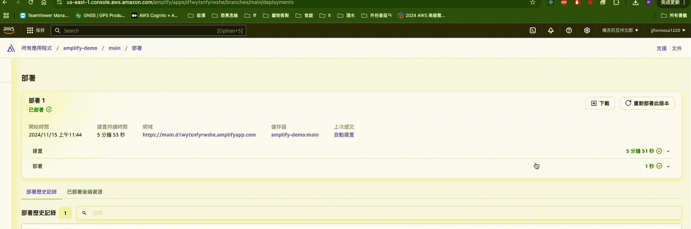

## run it, first
我的部署環境是AWS，開發語言基於Facebook的React，以及姑且可以稱Google開發的NodeJS(V8)，用蘋果電腦開發，還可以遇到什麼問題？最大的問題出在arm64(M1)，在執行一卡車安裝指令的時候常常失敗，或者，更現實的問題，在公司我需要協助、維護同事的程式碼的時候，同事跟我的開發版本不一樣，但是因為我的電腦上需要維護很多份程式碼，甚至AWS CLI也有依賴到Node版本，所以不見得方便切換Node版本。

## with Docker
幸好有Docker，可以讓我們依照專案指定rebuild用的版本，但那Docker本身搭配m1晶片，build出去的image常常沒辦法在第一時間跑起來，畢竟通常大家都是基於amd64，只有M系列是arm64，因此要特別注意，若你也是尊貴不凡的M晶片，記得習慣性給自己的docker加上 --platform=amd64，以下是我通常使用的Dockerfile(Dockerfile.dev)，用來產生開發環境的image:

```Dockerfile
FROM --platform=amd64 node:22.3-alpine
WORKDIR /app
COPY . .
EXPOSE 5173

ENTRYPOINT [ "sh" ]
CMD ["dockerscripts/dev-install.sh"]
```
如果你打開專案中的dev-install.sh，會發現該腳本沒什麼大不了的，也就是*npm install*和*npm run dev*而已，頂多加上支援輸入變數、判斷node_modeule是否存在，那麼為什麼不在Dockerfile撰寫*RUN npm install* 和 *CMD ["npm", "run", "dev"]*就好呢？這是因為這時候我的目標是製作「開發用的環境」，接下來搭配的指令(rundev.sh)如下
```sh
#!/bin/bash
img_name="amplify-dev:node-22-alpine"
port_num=5173

# 解析參數
while [ $# -gt 0 ]; do
  case $1 in
    --img_name=*)
      img_name="${1#*=}"
      ;;
    --port_num=*)
      port_num="${1#*=}"
      ;;
  esac
  shift
done

docker run -itd -p $port_num:$port_num -v .:/app -w /app "$img_name"
```
需要注意的是，因為這時候在開發，依然在變更檔案，所以實際上的需求是將專案資料夾，掛到一個指定的執行環境(container)裡面，那麼如果在第一次build image的過程中執行*npm run install*，等到專案資料夾第一次binding container，還不具有node_modules的專案資料夾就會把工作目錄*app* 已經安裝好的環境又蓋過去，當然，你也可以透過更複雜的腳本，在容器中其他資料夾install後再把node_modules移動到工作目錄，但相較之下我覺得目前這樣簡潔一點。以上issue，你可以改使用專案中的Dockerfile.devissue打包image，看看結果的不同。

## so go on
AWS Amplify的部分先姑且放下，這個專案是基於[Amplify React Template](https://docs.amplify.aws/react/start/quickstart/#make-frontend-updates)繼續寫下去的，既然是React，他就應該要能先讓我們在本機端看到畫面，檢查**package.json**，也會看到前端或者NodeJS的工程師熟悉的指令
```json
"scripts": {
  "dev": "vite",
  "build": "tsc && vite build",
  "lint": "eslint . --ext ts,tsx --report-unused-disable-directives --max-warnings 0",
  "preview": "vite preview"
}
```
但在container順利執行腳本後，也看到log中那令人振奮的畫面了


可是瀏覽器卻有可能連接不上，只有令人心碎的畫面


這是因為，在Container中的Node環境，就只接受一樣來自它的localhost來源請求，而開發機上的瀏覽器相較於Container是**另一台機器**，這是我在工作上常遇到同事剛開始接觸Docker的時候相對常見的問題，包括
- 在開發機上，執行指令後可以透過localhost打開網頁，用了Docker就不行
- 在Docekr中的程式碼連不到另一個Docker，或者開發機上的資料庫
- 總之就是各種連線失敗
這一類問題，其實Google或者透過ChatGPT，都有人/AI說明得很清楚了，就不在這邊野人獻曝，總之現在需要把專案中的腳本調整一下，從 *\"dev\":\"vite\"* 改為 *\"dev\":\"vite --host 0.0.0.0\"* ，然後把前次操作生成的Container刪掉，重新執行 *dockerscripts/rundev.sh*，這下瀏覽器就有收到回應啦!!


## just another day in life of dev 
從錯誤中我們可以看到是因為少了一個*amplify_outputs.json*檔，這是其中一個選擇AWS Amplify的原因，作為一個相對老的開發者，這個檔案讓我聯想到的是像firebase message，或者諸如此類服務需要下載，並且放到專案中的檔案，不論是網站、Android或者iOS都需要它。回到[AWS文件](https://docs.amplify.aws/react/start/quickstart/#4-set-up-local-environment)，這個json檔的來源，跟開發者透過AWS Amplify維護的後端服務有關，也就是說也許透過這個檔案與Amplify跨平台的SDK，可以讓Amplify支援的每個平台，包括React(含Next)、Vue、Angular、Flutter、Android與iOS(Swift)，都可以使用同一份文件，實現功能的串接。
但遺憾的是有個大前提， **後端目前只有Node**。雖然對於我這類支持前後端一個語言的開發者來說，這是一份獎勵就是了。總而言之，依照文件的提醒，我們需要先部署Amplify，取得amplify_outputs.json檔案，才能讓網站順利跑起來。

請特別注意，透過CI/CD開始需要費用，以及AWS帳號、專案，也需要版控平台，基本上還要AWS CLI跟AWS SDK，這些基本的前輩知識都不在這邊提了，只是下載json檔案的過程蠻迷幻的，附上gif



這個流程有點讓人不爽的地方是，想要先看到前端，反而要先做一次部署。但實際上，[閱讀Amplify文件有一章就是在提醒應該前端歸前端，後端歸Amplify](https://docs.amplify.aws/react/deploy-and-host/fullstack-branching/mono-and-multi-repos/)，上面也有提到，照理說有了*amplify_outputs.json*和該語言的*amplify SDK*，應該要讓每一位開發者都可以使用同一份plugin嗎，也就是說，如果不像我偷懶懶把網頁前端也放進同一個Amplify專案，實際流程應該是用AWS Amplify去部署後端=>得到amplify_output.json，交給前端同事們(or自己......)，但後端專案本身就有前端也有一個好處，就是後端人員可以簡單操作、測試，甚至可以用來打造簡單的腳本和後台維護資料。
另外這裡有個小坑，你會發現首次Build的過程，還沒有下載json檔案，但是amplify依然可以build出前端，加上官方的範例中也把*amplify_outpus\**列在gitignore清單中，所以如果你換了電腦或專案資料夾、同事首次pull專案，都得手動把json弄過去一次，所以確實會建議前後端分開維護。

## before continue...
至此先列一下AWS Amplify/AWS full stack的優劣勢、個人對他的期待與失望

優點
- 便宜的CI/CD方案，Amplify每次更新、建置、部署，每分鐘只收0.01美元
- 直接使用AWS SDK控管資料，因為Amplify Client SDK幾乎都要配合authorization機制，使得資料存取權相對安全
- 宣告式的方法定義資源，不用很熟悉NodeJS和AWS提供的各種服務，就可以建立出蠻完整的系統
- 前面說到的減少Client多平台的問題
- 幾乎所有預設的服務都是隨需支付，而且天生有AWS各項服務保證的SLA、基本的資安保障
- Amplify 只是幫忙整合、部署AWS基礎設施如DyanmoDB、Lambda、Cognito、s3......等等，用你熟悉的方式如AWS Console、CLI來維護資料，也可以把已經存在的資源再整合進Amplify專案，換句話說，我們有最終而且熟悉的手段去維護這個看起來像盲盒的東西

缺點
- 需要客製化功能的時候，還是要閱讀AWS那難以閱讀的文件，而且Amplify官方案例也不多，不是本來就熟悉AWS的人員可能完全不知從何處理bug或開發
- NodeJS，雖然對我是獎勵
- Amplify會擅自開很多服務、定義很多角色，團隊的主管、Ops或資安部門潔癖發作的時候，很難針對權限收拾
- 呈上，實際用在營運的話，很有可能有意料之外的費用，服務意外下線等突發狀況時，排除問題的成本可能也相對高

個人最大的期望與失望
1. 雖然一直提到讓前端共用plugin，但實際上我還沒有機會測試瀏覽器端以外的環境，在接下來的章節，讀者應該也會體會到為什麼對這個說法有疑慮
2. AWS有推出協助工程師的AI工具[AWS Q Developer](https://docs.amplify.aws/react/build-a-backend/q-developer/)，找到這個工具的時候我非常振奮，以為他可以節省難以下嚥的AWS文件的時間，然而它針對Amplify，甚至AWS SDK的準確度頗令人髮指，倒是在猜測工程師的意圖、提供建議這個部分表現得令我蠻驚訝的，也許接下來有機會，會跟眼下更流行的Cursor做比較。
3. 以及下一章會提到的，Cognito的整合social login，是整人的整

### 延伸閱讀
[關於開發機器上，無法重現開發/建置環境的案例](./FCM_UTIL.md)
