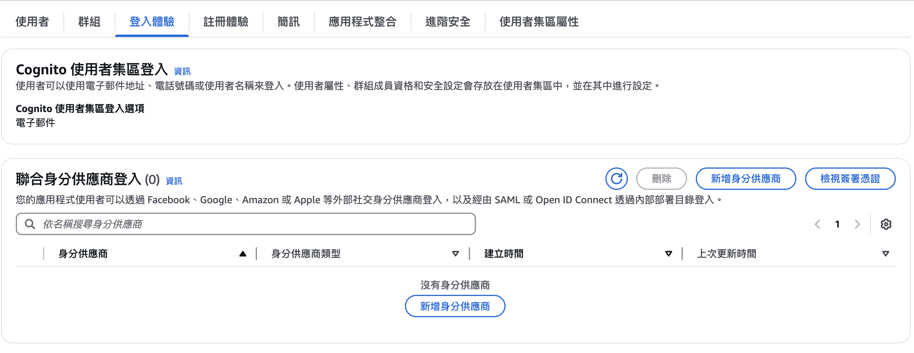

## with social login

### 先來看看昨天部署後得到什麼成果


<!---->

要提醒一下，這是因為Amplify的官方React案例，剛好透過npm run build，dist就是該靜態網站成果，我的個人Sideproject是vue+quasar，嘗試過把腳本改成npm install -g quasar && npm install && quasar build，但是沒有成功，因此我是在本機build完，將dist資料夾壓縮上傳。如果你也有用相對複雜的腳本，成功讓前端實現CI/CD，可以的話請交流。

但總之，透過範例也得到了一個前台網頁，實際上我沒有特別去看它是基於什麼服務Host的，但確定沒有偷開EC2之類的按時收費服務，依然是隨需支付的產品，目前知道這樣就夠了。

### 再來看看Amplify還提供什麼


雖然入口有點迷幻，但總之除了前台網頁，似乎也得到一個後台。實際上Amplify是幫你啟用了Cognito這個服務。而在Amplify的網頁介面上我們可以做簡單的帳號/群組創建與刪除，但是第一張圖的前台畫面，並不需要任何登入/身份驗證就可以使用TODO List，這是因為[官方範例故意要你跟著文件逐步練習](https://docs.amplify.aws/react/build-a-backend/auth/set-up-auth/)，其實個人覺得蠻意外的，我原本以為練習歸練習，Sample應該像其他的架站服務那樣，部署完就有一定程度的功能，讓非技術人員可以快速展開工作，但並沒有，連登入都要技術人員介入，反而透過Amplify**非技術人員可以先準備資料了**，後面也會展示到怎麼透過Cognito維護資料

> 也許，這樣可以做到團隊裡面沒有人很熟悉AWS服務的串接與設定，但就可以透過簡單的指令架設系統，並且讓非技術人員透過AWS介面提前維護資料，不需要後台開發

先看一下Amplify的專案架構和文件概念，可以簡單理解為Amplify資料夾管後端，src管前端。而src的部分實際上與一般React專案無異，Amplify資料夾下已經可以看到預設有*auth*跟*data*兩個部分。


以這篇的主題來說，先關注auth資料夾


在文章前面的gif看到的內容，就是這麼被resources.ts定義出來的「使用者需要透過信箱登入」。依照官方文件去練習不是什麼難事，甚至都可以兜出一個[具有MFA流程的服務了](https://docs.amplify.aws/react/build-a-backend/auth/concepts/multi-factor-authentication/)，也可以得到一個[兼具信箱和密碼登入，也有主流Social Login功能的畫面](https://docs.amplify.aws/react/build-a-backend/auth/concepts/external-identity-providers/)，就請讀者有需要的話自己抄作業(~~因為MFA要算錢~~)，而我看到這邊，以為AWS Cognito可以自動以信箱為辨識，整合一個帳號的Social Login，這樣的話只要同一份auth/resources.ts到處放，頂多配合AWS後台的external provider畫面點一點，就可以很快處理完客戶常常想要的需求，但果然，事情都不是憨人想的那麼簡單，Social Login背後通常牽涉到OIDC(OpenID Connect)機制，網路上已經很多文章說明這個關鍵字了，這邊就不再贅述(~~畢竟講得沒人家好~~)，就直奔我上鉤的核心 **Line Login 也是 OIDC**。

還是要簡單說一下OIDC這一脈的特徵，一言以蔽之的話就是**是否以這個身份繼續操作App，全憑使用者本身的授權意願**，用實際一點的案例說，如果App提供的是輸入帳號密碼的登入，開發者相對方便實現捕捉登入錯誤、拒絕登入的紀錄；但是OIDC相對強調使用者的授權意願，流程上通常會被身份供應商(ID Provider)以轉址到供應商名下網域，例如FB Login、Google Login具有很明顯的轉址行為，並且提醒使用者需要授權，這樣開發者其實並不方便直接捕捉登入錯誤或放棄登入(授權)的使用者，另外使用者可以在Scocial Login平台上主動停止提供App授權，讓開發上必須考慮更多例外的可能性。

Socail Login是不是真的就比較安全......不是很肯定，但客戶總是會想要這些酷酷的功能，特別是台灣的業主非常習慣以Line來維持客戶關係(~~並要求加班~~)，雖然Line還不夠大到讓AWS主動提供支援，但看起來只要寫好設定檔，就能實現Socail Login元件自由了，工程師頂多就是應付客戶的**UI需求**做調整，該留意的是，受制於ID Provider方的要求，**UX不見得能設計的盡如客戶的意思**，因此其實我本來也懶得立刻實作下去(~~而且公司又掉案~~)，一個高中同學意外提供了一個SidePoject的機會，另外一位高中同學提供了可能的解決方案 **透過Line App開啟在Liff平台註冊網址，並且使用Liff SDK和Liff域名的網站，可以在使用者無感的情況下取得授權。** ，也就是說，直接在自己的網站上確認授權狀態又變得可行，雖然環境有所限制，但該環境剛好是業主會想要的(台灣的業主甚至可以接受限制使用者只能透過Line才能進行某些操作，例如領取特定優惠卷，如果文章有繼續寫之後再來談。)，那就開始動手吧！

### 先從設定開始
[LIFF設定跟著官方設定就好](https://developers.line.biz/en/docs/liff/overview/#line-api-use-case)，這邊只highlight開發需要留意的地方


從[AWS Amplify文件開始閱讀AWS方面的設定](https://docs.amplify.aws/react/build-a-backend/auth/concepts/external-identity-providers/#configure-oidc-provider)其實不容易吸收，所以下面先從AWS 畫面設定走一遍。


從Amplify後台找到Cognito資源，UserPool是實際提供App身份的功能，可以直接當作後台管理使用者。


在Cognito > 登入體驗，這邊可以管理身份供應商，這麼一來UserPool就可以接受該供應商的身份



新增供應商的時候，依照一些關鍵字填入對應的欄位


繼續填，雖然Permission可以跟ID Provider填不一樣，但一般來說申請了ID Provider就是要在App端使用


接下來 *發行者URL* 這欄就比較麻煩，並不是Line Devlper看到的liff.line.me，也不是Line Login Api的 line.api.me(liff SDK實際上就是包裝line login api而已，讓開發者省去處理Request、Response的包裝、驗證工作)，而是OIDC這個標準規定的，負責auth token的頒發、驗證的端點，但大致上我並沒有在Line的官方文件找到相關的說明，是靠著參考其他人串接OIDC經驗的文件，加上Try&Error大法找到的，方法也留下來做個參考。

1. 既然符合OIDC的標準都需要提供該服務，那麼Line肯定也有提供
2. 它是負責Token頒發與驗證的API，所以呼叫Line Login或者Liff Login肯定有呼叫，然而liff就是呼叫api.line.me而已
3. 參考AWS的文件，有提到[當Cognito作為OIDC時，需要作為發行者API欄位填入的iss為login.provder.com](https://docs.aws.amazon.com/zh_tw/cognito/latest/developerguide/open-id.html)，有趣的是，當我們用這個關鍵字去查line login與iss的相關資料，會發現他是IdToken的一部分，也就是說只要parse Line Login/Liff給予的IdToken，它的iss欄位就是要填入的endpoint了。這時候你應該已經開通了一個liff服務，可以直接試著在自己的程式碼實踐初始化liff、呼叫登入、取得idToken一次，或者用[liff貼心的playground](https://liff-playground.netlify.app/)取得，然後放到[jwt.io](https://jwt.io)去解析看看(~~其實playround跟api有getDecodeIdToken~~)


4. 終於知道了line真實的issue單位是access.line.me，這個結果感覺也符合OIDC的理念，就是收到token的人，應該給予權利，也應當自己去驗證可信度。當然，如果我先好好讀過OIDC的文章就不用繞這麼多圈子，但這就是另一個故事了。

另外要實測前，記得把開發環境，例如localhost:port，或者stage得到的前端網址，例如https://main.d1wytxnfyrwshe.amplifyapp.com/ 加入line login 允許的callback網址清單。

以我的狀況就是這樣


5. AWS最後一批欄位，是指對Cognito來說，你希望它自動與外部ID Provider Mapping哪些屬於OIDC規範中的欄位

因為展開選單效果不好我就不展開了，總之可以看到發現line揭露的欄位確實符合OIDC標準(與AWS可選的名稱一致)


### 先看看成果，結束這一天吧
對比[AWS Amplify的開發文件](https://docs.amplify.aws/react/build-a-backend/auth/concepts/external-identity-providers/#configure-oidc-provider)，其中auth/resources.ts的內容，這時候應該可以意識到前面強調的概念

> Amplify讓團隊得以AWS後台，或者開發者以宣告的方式，共同維護一個應用程式，端看團隊的強項；當然，團隊中有人很熟悉AWS資源整合的話，大腿抱好就好

```typescript
import { defineAuth, secret } from '@aws-amplify/backend';

export const auth = defineAuth({
  loginWith: {
    email: true,
    externalProviders: {
      oidc: [
        {
          name: 'MicrosoftEntraID',
          clientId: secret('MICROSOFT_ENTRA_ID_CLIENT_ID'),
          clientSecret: secret('MICROSOFT_ENTRA_ID_CLIENT_SECRET'),
          issuerUrl: '<your-issuer-url>',
        },
      ],
      logoutUrls: ['http://localhost:3000/', 'https://mywebsite.com'],
      callbackUrls: [
        'http://localhost:3000/profile',
        'https://mywebsite.com/profile',
      ],
    },
  },
});
```

不過反過來說，這時候已經不需要再resources在設定一次Auth/Cognito，但也不完全是 **[使用已經存在的資源](https://docs.amplify.aws/react/build-a-backend/auth/use-existing-cognito-resources/)** ，因為我是從部署後，Amplify自動建立的Cognito繼續加入外部供應商(external provider)，所以也不需要完全照著Amplify文件做(~~要證明在圖形化介面做，開發端可以收到一樣效果~~)，從文件中可以觀察到還填不出來的剩一個欄位 *userPoolClientId*


應用程式用戶端(UserPoolClient)在將來是一個**不被必要的存在**，但今天我們就利用這個**Client**做ending，這個服務本來是讓開發者得到一個Cognito的網頁，就像facebook、google login，點擊官方提供的預設按鈕之後，會跳出來一個頁面允許登入的概念，所以如果有乖該照著Amplify或Cognito的流程去定義，其實你應該會得到一個網頁如下畫面


上圖是指，使用Cognito託管的UI，就長那樣子了，沒辦法客製化，但如果當初是選擇自訂網址，就可以用自己的網頁了，**但是要寫程式碼**，而這個範例專案，已經有了自己的前端網頁，所以其實沒必要讓Cognito託管，或者額外準備一個網頁接AWS SDK，我們可以在同個專案去實作客製化功能。

但是，這篇文章已經很長了(~~今天好累了，我一直想結束它~~)，所以直接用Cognito託管的功能，驗證前面設定的External Provider是正確的。

1. 首先需要登入頁面使用的網址，這邊我繼續用Cognito託管


2. 點擊UserPoolClient


3. 點擊編輯託管UI


4. 新增供應商，即前面加入的amplify-line-demo-provider


5. 回到託管UI，換點擊檢視託管UI


6. 鏘鏘！，你也有Line 登入了，而這個網頁就是步驟1.指定的網址


7. 但是，出錯了！！！雖然Cognito確實有將 **使用者導向Line**


不知道還有多少觀眾聽過富奸這個形容詞，總之，我覺得篇幅已經太長了，上面的錯誤是需要觀察、解釋OIDC的更多細節，先預告預計Amplify Auth的部分總共約需要4~5個篇章，還請耐心看待。

> 有注意到本篇都沒有更新程式碼嗎？