## 前一天設定怎麼了

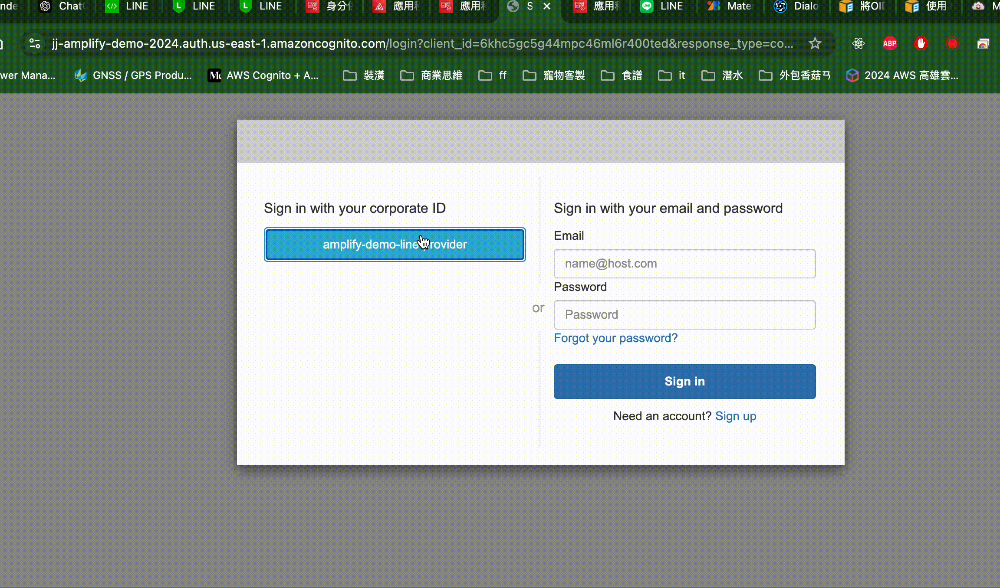

雖然這個結果讓人有點沮喪，至少當時的我是，但是觀察line 400的定格畫面可以找出來幾個問題

1. 網址:access.line.me/oauth2/v2.1/authorize?client_id=2004822790-ndEy8LlX&redirect_uri=https%3A%2F%2Fjj-amplify-demo-2024.auth.us-east-1.amazoncognito.com%2Foauth2%2Fidprespons，提醒我們Cognito託管UI的網址，不在Line Login允許清單裡面，要注意/oauth2/idpresponse也是網址的一部分

>注意，我們之前新增的是*Amplify Host的網頁，不是Cognito託管網址*

2. 400畫面上的錯誤訊息說到 *type 'java.lang.String' to required type 'java.lang.Integer' for property 'clientId'; For input string: "2004822790-ndEy8LlX"* ，但是ClientID大概是沒有抄錯的，2004822790是整數，2004822790-ndEy8LlX是字串，liff實際上是封裝Line Login的SDK，也就是說access.line.me，認得的可能不是liff而是Line Login的ClientID。

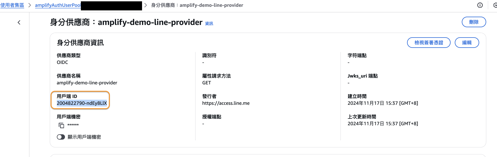

### 看到熟悉的、屬於自己的畫面了


## what's next
當然是先登入啊，然後就可以看到Cognito的使用者，多了一個親切的帳號
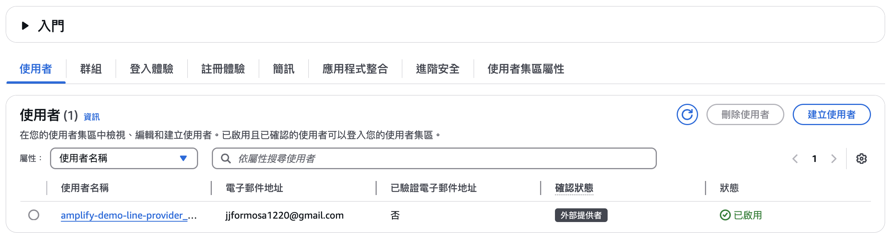

> 至此，對比Amplify官方文件，[Configure OIDC Provider](https://docs.amplify.aws/react/build-a-backend/auth/concepts/external-identity-providers/#configure-oidc-provider)章節。
> 如果你照著官方文件做，amplify/auth/resource.ts的部分其實是在透過Amplify的宣告手段，代替Day2到現在，透過AWS網頁介面的操作，好處是做完一次，每次branch/fork專案以後去部署，都可以不用重做一次前面的步驟，缺點是，記得前端需要amplify_output.json才可以真正使用Amplify部署的資源嗎？所以在開發還需要逐步測試前，都得部署後端=>下載檔案=>部署前端，解決方法除了分離前後端，另一個方法是使用sandbox[^1]。
> 而且，先了解Amplify啟用了什麼資源還是很重要的。

## 撰寫前端
再提醒一下，到目前的成果
1. 沒辦法修改Cognito託管的UI
2. 使用者不像傳聞中的，不需要透過轉址就完成登入

所以，接下來還是需要工作，需要工程師，而且提醒另外一件事情，這個範例是React專案，所以可能需要先[具備一定前端水準](https://legacy.reactjs.org/tutorial/tutorial.html)

間單提一下前端框架，如React的目的。在網頁上想要依照需求呈現畫面有兩種典型的模式：
1. SSR(Server Side Render)，其模式為每一個畫面都由後端(Server)畫出最終的HTML，再回傳給瀏覽器，因此畫面即使是同一份清單，使用者點擊第一頁、第二頁，瀏覽器上的網址都會改變，而且使用者有可能感受到loading、閃一下等重新渲染的狀況。

2. SPA(Single Page Application)，其模式為後端只回傳第一筆資料的畫面，後續的變化都由AJAX、直接改變DOM實現，通常會搭配jQuery簡化工作。典型的應用場景如網站需要持續播放音樂、或者配合地圖導覽、聊天客服等。

更多knowledge就不贅述了，如果連SSR、SPA(CSR、SSG)這些關鍵字都還很陌生，幾個篇幅也很難說完，總之如React這種前端框架，想解決的根本問題只有一個，**降低SPA的渲染成本**，其他提升開發者體驗的部分都是良心事業。

<!-- TODO 同事的討論串系列，你通常從API開始開發，還是從Model開始 -->

[Amplify的文件](https://docs.amplify.aws/react/build-a-backend/auth/concepts/external-identity-providers/#configure-oidc-provider)，src/my-client-side-js.js的部分就是在說怎麼在前端指定登入的方法，所以我們把src/pages/Login.tsx的部分，先試著做看看

### 24/11/26重大訊息
> AWS的界面包括cognito有大改版，但之前的畫面我就不重新截圖的，還是要自己練習用名詞對照的。Amplify的SDK也貌似多出一個使用[現有的Cognito資源的方法](https://docs.amplify.aws/react/build-a-backend/auth/use-existing-cognito-resources/#use-auth-resources-with-an-amplify-backend)，總之我在11/17從頭開始的amplify-react專案，還沒有referenceAuth可用，直到砍到node_modules和package-lock.json後，重新安裝才有referenceAuth方法可用。
> 但是，我填上現有的resource後，build的過程Amplify反而把該userPoolClient與identityPoll砍掉了......，才有了以下複雜的做法，強烈建議觀眾弄清楚Amplify跟Cognito的關係以後，一律用Amplify宣告和部署資源，與現有資源的合作似乎還有很多issue存在。

1. 在[這份文件中](https://docs.amplify.aws/react/build-a-backend/auth/concepts/external-identity-providers/#configure-oidc-provider)可以觀察到，想要直接使用aws-amplify/auth的功能，從backend需要定義對應的external Provider資源，在前端才能使用相對應的provider

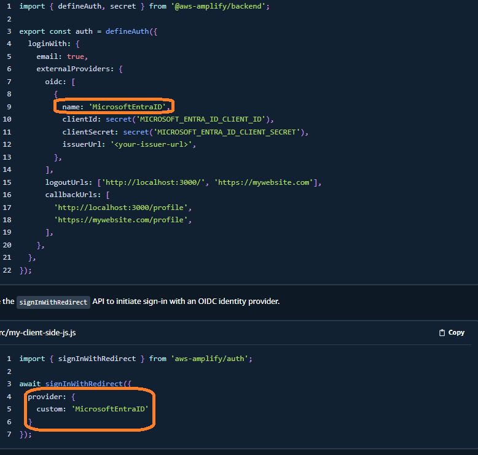

所以對應我們前一天在Cognito新增的provider，在前端需要以下呼叫
```src/pages/Login.tsx
// src/pages/Login.tsx
import { useCallback } from "react";
import { signInWithRedirect } from "aws-amplify/auth";

export const Login = () => {
  // const $currentUrl = useCurrentUrl();

  const doLogin = useCallback(() => {
    signInWithRedirect({
      provider: {
        custom: 'amplify-demo-line-provider'
      }
    })
  }, [])
  
  return (
    <div className="p-4">
      <button onClick={doLogin}>Login</button>
    </div>
  );
};
```
2.但是如果仿造上面的resources.ts，會遇到externalProviders amplify-demo-line-provider已經存在的問題，所以我們要[改用referenceAuth](https://docs.amplify.aws/react/build-a-backend/auth/use-existing-cognito-resources/#use-auth-resources-with-an-amplify-backend)而不是defineAuth

```amplify/auth/resource.ts
// amplify/auth/resource.ts
import { defineAuth, referenceAuth } from '@aws-amplify/backend';

/**
 * Define and configure your auth resource
 * @see https://docs.amplify.aws/gen2/build-a-backend/auth
 */
// export const auth = defineAuth({
//   loginWith: {
//     email: true
//   }
// });

export const auth = referenceAuth({
  userPoolId: 'us-east-1_2IiNcr9UG',
  userPoolClientId: '2flnjcttd6vdv92ad5lsuf9lu6',
  identityPoolId: 'us-east-1:4198ad33-f56b-4d81-8493-9710a3f23e06',
  authRoleArn: 'arn:aws:iam::540052993261:role/service-role/amplify-demo',
  unauthRoleArn: ''
})
```
3. *但是，先不要push，不要部署*，先讓我們把目光轉向amplify_outputs.json
```amplify_outputs.json
"auth": {
    "user_pool_id": "us-east-1_2IiNcr9UG",
    "aws_region": "us-east-1",
    "user_pool_client_id": "6khc5gc5g44mpc46ml6r400ted",
    "identity_pool_id": "us-east-1:6b1f8f7e-3c11-46db-b230-6100b6d057e9",
    "mfa_methods": [],
    "standard_required_attributes": [
      "sub",
      "email"
    ],
    "username_attributes": [
      "email"
    ],
    "user_verification_types": [
      "email"
    ],
    "mfa_configuration": "NONE",
    "password_policy": {
      "min_length": 8,
      "require_lowercase": true,
      "require_numbers": true,
      "require_symbols": true,
      "require_uppercase": true
    },
    "oauth": {
      "identity_providers": [],
      "redirect_sign_in_uri": [
        "https://example.com",
        "https://main.d1wytxnfyrwshe.amplifyapp.com"
      ],
      "redirect_sign_out_uri": [
        "https://localhost:5173",
        "https://main.d1wytxnfyrwshe.amplifyapp.com"
      ],
      "response_type": "code",
      "scopes": [
        "aws.cognito.signin.user.admin",
        "email",
        "openid",
        "phone",
        "profile"
      ],
      "domain": "jj-amplify-demo-2024.auth.us-east-1.amazoncognito.com"
    },
    "unauthenticated_identities_enabled": true
  },...
```

會看到一段auth的key-value，事實上跟Cognito裡面的各項設定吻合，也就是說，我們修改amplify_output.json，其實就可以更改client端使用的資源了，這跟我們要在Amplify SDK使用透過AWS CLI/AWS Console處理的資源需求一致，所以就來連連看吧!
> 再次強調，會看到我需要這樣變更amplify_outputs.json是因為我使用refreenceAuth部屬後userPoolClient跟IdentityPool反而消失了，如果從一開始就乖乖從defineAuth處理就不會這樣

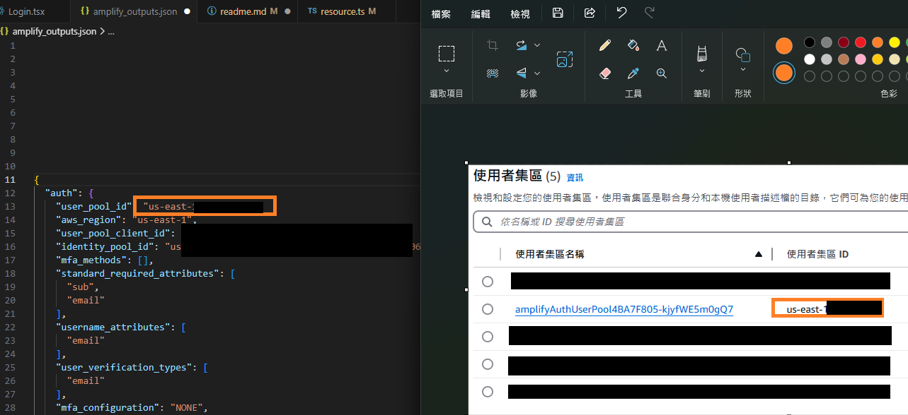

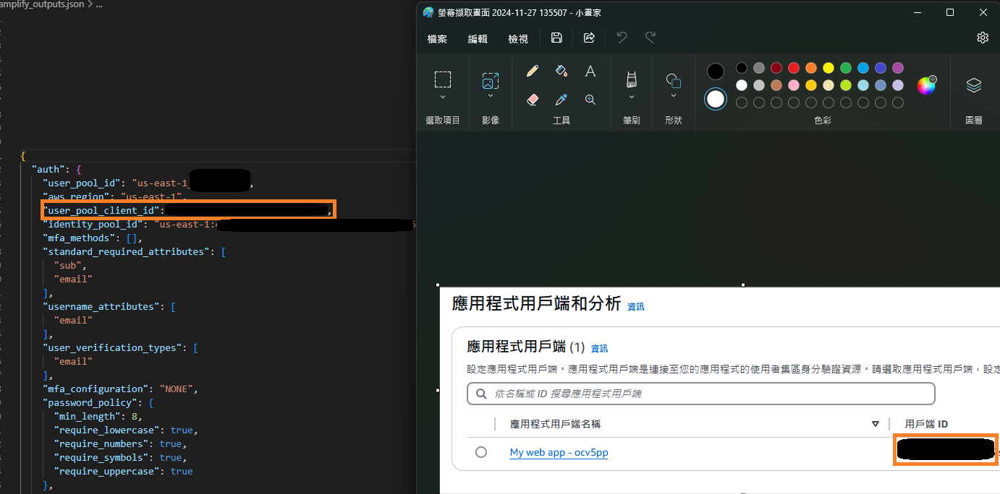

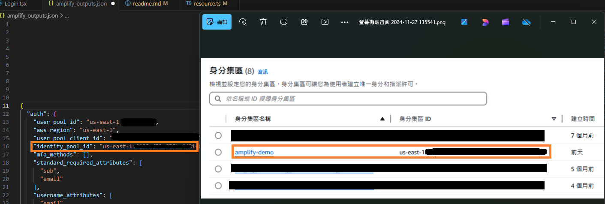

4. 來看看效果，有指定customProvider的情況

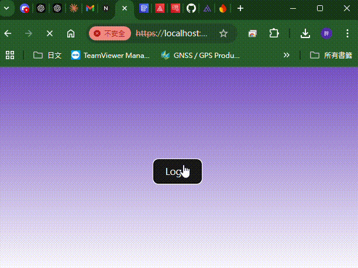

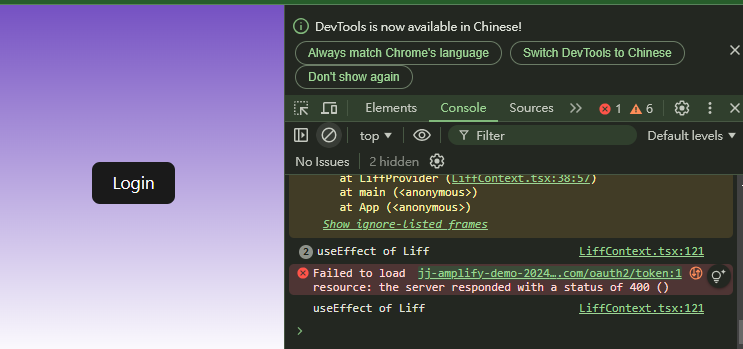

5. 如果不指定Provider
```src/pages/Login.tsx
// src/pages/Login.tsx
import { useCallback } from "react";
import { signInWithRedirect } from "aws-amplify/auth";

export const Login = () => {
  // const $currentUrl = useCurrentUrl();

  const doLogin = useCallback(() => {
    signInWithRedirect()
  }, [])
  
  return (
    <div className="p-4">
      <button onClick={doLogin}>Login</button>
    </div>
  );
};
```

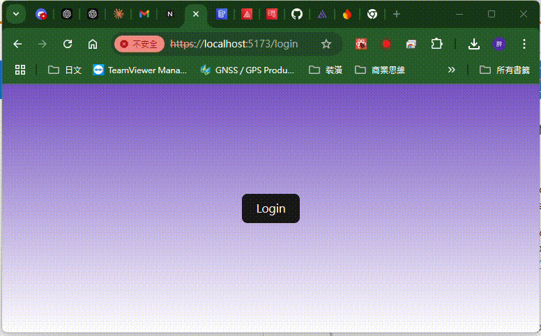

## 那個verify fail是怎麼回事

回報錯誤的網址是https://jj-amplify-demo-2024.auth.us-east-1.amazoncognito.com/oauth2/token，但是在Day2，我們透過同樣的Cognito託管的UI是可以登入成功的，所以我懷疑一件事，有問題的是*liff.login後的token*，而且有印象昨天我們也是把liff的AppID，改為Line Login的ID，Cognito託管UI才有作用嗎？但是也不要忘了，line官方確實說liff也是遵循OIDC的規範做的，於是在網路上苦尋之後，終於找到[這篇找到關鍵問題](https://blog.miniasp.com/post/2022/04/08/LINE-Login-with-OpenID-Connect-in-ASPNET-Core)**ValidateSignature**，詳情參考保哥的文章即可，但這邊示範一下怎麼驗證文章中的問題

1. 首先，想辦法透過你的liff App取得一筆idToken
2. 將idToken丟到[jwt.io](https://jwt.io/)解碼會發現，payload是解開了，但是簽章驗證有問題

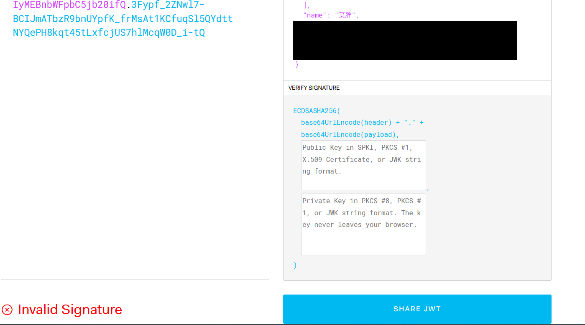

3.依照保哥的文章的說法，我們需要從line這個ocid[供應商的憑證中](https://api.line.me/oauth2/v2.1/certs)，找到適合的憑證解碼。

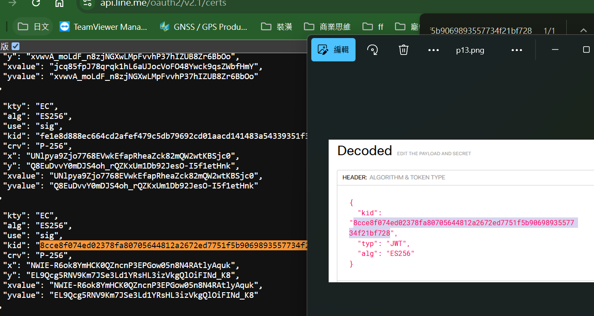

接下來具體要怎麼簽出公鑰來驗證簽章，可以問AI就好，今天到這邊我們知道liff.login會有這個問題即可，現在我們要思考的是

### 一定要是liff嗎
是的，~~這樣我才有文章繼續寫~~，因為我希望使用者可以不點擊就不要點擊，如果我們繼續使用Line Login，auth flow會是

1. 使用者點擊button
2. 轉到Line授權畫面
3. 使用者還要按一次登入
4. 回到自己的網頁

但這邊就交給讀者想看看，**這個UX到底是不是你需要的**，總而言之，為了使用者可以不用在LineApp裡面，還需要點擊一次按鈕來授權line login，我覺得liff是必要的。但想要處理這個問題，下一章我們要開始處理AWS Cognito客製化登入的機制，順帶一提，這太早了，本來這應該是MFA才開始需要接觸的議題。

<!-- TODO 延伸閱讀
[^1]:use sandbox
[^2]:程式碼從哪邊開始，API還是Model
-->