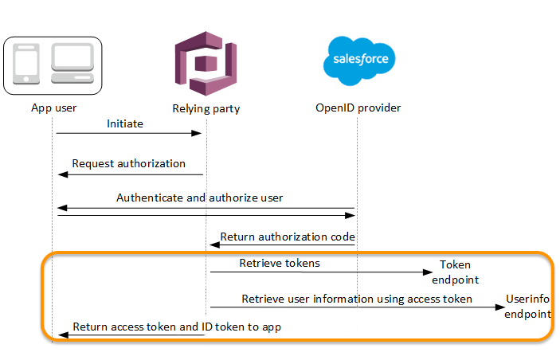

## 我換了一個git repo
因為從這章起，auth資源最好來自**ampfliy/auth/resources**定義。

[**強烈建議延伸閱讀官方文件，看Cognito怎麼與OIDC合作的**](https://docs.aws.amazon.com/zh_tw/cognito/latest/developerguide/cognito-user-pools-oidc-flow.html)



[Amplify的解決方案](https://docs.amplify.aws/react/build-a-backend/data/customize-authz/using-oidc-authorization-provider/)依然很難客製化，而從上圖看起來，只需要把第三方的token交給Cognito，並且告訴它這是來自哪個第三方(External Provider)即可。

> 其實我忘了當初flow怎麼找到文件的，以下解答來自Amazon Q的說明

```typescript
import { signIn, type SignInInput } from 'aws-amplify/auth';

interface OIDCAuthParams {
  accessToken: string;
  idToken: string;
  // other OIDC-specific parameters
}

async function handleOIDCSignIn(oidcParams: OIDCAuthParams) {
  try {
    // Extract relevant information from OIDC tokens
    const signInInput: SignInInput = {
      username: 'user_identifier', // This could be email or other unique identifier
      options: {
        authFlowType: 'CUSTOM_WITHOUT_SRP',
        clientMetadata: {
          identitySource: 'amplify-demo-line-provider',
          accessToken: oidcParams.accessToken,
          idToken: oidcParams.idToken
        },
        // You might need to include additional attributes
        userAttributes: {
          // Map OIDC claims to Cognito attributes
          email: 'user@example.com',
          // other attributes as needed
        }
      }
    };

    const signInResult = await signIn(signInInput);

    if (signInResult.isSignedIn) {
      // Handle successful sign-in
      return signInResult;
    } else if (signInResult.nextStep) {
      // Handle any additional steps if required
      console.log('Additional step required:', signInResult.nextStep.signInStep);
      // You might need to handle various nextStep scenarios
    }
  } catch (error) {
    console.error('OIDC sign-in failed:', error);
    throw error;
  }
}

// Example usage with custom UI
async function handleCustomUILogin() {
  // 1. First handle the OIDC authentication through your custom UI
  // 2. Get the OIDC tokens from your provider
  const oidcParams = {
    accessToken: 'your-access-token',
    idToken: 'your-id-token'
  };

  // 3. Use the tokens to sign in with Amplify
  try {
    const result = await handleOIDCSignIn(oidcParams);
    // Handle the sign-in result
  } catch (error) {
    // Handle errors
  }
}
```

從Amazon Q的建議來看，大致上可以知道，實務上如果想要完全取代AWS本身提供的畫面，我們還是要自己實作第三方登入，拿到token以後，以 *CUSTOM_WITHOUT_SRP* 模式向Cognito請求登入。那就需要了解這是甚麼。

根據[Amplify的說明](https://docs.amplify.aws/react/build-a-backend/auth/connect-your-frontend/switching-authentication-flows/)可以知道Cognito的幾種模式的比較，如果使用其中的*CUSTOM_WITH_SRP 或 CUSTOM_WITHOUT_SRP* ，會需要麻煩一點[**自訂流程**](https://docs.aws.amazon.com/zh_tw/cognito/latest/developerguide/user-pool-lambda-challenge.html)，但比較一下Cognito的幾種模式
1. USER_SRP_AUTH跟USER_PASSWORD_AUTH，不論密碼是否會送給server，跟第三方登入流程都不符。
2. USER_AUTH看起來主旨在支援比較制式的MFA，以及Cognito本身作為External Provider的時候，也許之後我們可以使用。

[!自訂挑戰的流程圖](https://docs.aws.amazon.com/zh_tw/cognito/latest/developerguide/images/lambda-challenges1.png)

制式一點的挑戰，其實就是設定你最愛的顏色、國小老師的名字這種提示語用法，也可以用來請使用者輸入看到的顏色、信箱收到的數字等，官方範例是我不是機器人的機制，其實相當的自由，也可以做到一定程度的MFA，但這邊我會偷懶一下，~~因為MFA要錢，設計題庫又很麻煩~~ 

[!加上外部登入的流程](./resources/p1.png)

簡單做個流程，其實核心只是把Create Challenge的問題改為Double Check是否是以Line進行登入(define challenge)，如果確定的話由Client送出的答案為Liff Login取得的Accesstoken，Server端的驗證作法從比對題庫改為向Line做驗證。這不是一定的流程，你大可依照自己的安全性或UI/UX考量做修改，例如我有想過額外透過Line Message API送個驗證網頁到使用者帳號，確保登入者身分，但是因為**Challenge系列必須維持在SPA的特性**下，Amplify Client才有辦法維持一個session完成挑戰，故目前暫時放棄，這也再次提醒一個重點
> Cognito的流程有其限制，務必先確認客戶的需求再做選擇

也因為需要跟Cognito的Lambda Trigger配合，這種情境下我就不推薦用AWS Web Console先設定，再使用現有資源了。如何透過文件設定[Amplify Gen 2的外部供應](https://docs.amplify.aws/react/build-a-backend/auth/concepts/external-identity-providers/#configure-oidc-provider)、[Lambda Trigger，即Challenge的部分](https://docs.amplify.aws/react/build-a-backend/functions/examples/custom-auth-flows/)，或者[Cognito更詳盡的範例](https://docs.aws.amazon.com/zh_tw/cognito/latest/developerguide/user-pool-lambda-challenge.html)，參考文件或Day4分支即可，下面只列出前端程式碼各部分的權責

```typescript/React
// src/services/amplify/auth.ts 
// 定義loginWithLiff方法，接收accessToken與idToken

// src/context/amplify/AuthContext.tsx
// store Amplify Auth狀態

// src/hook/amplify/auth/useAmplifyAuth.tsx
// 引用AuthContext
// 使用生命週期，在畫面產生前就先檢查Amplify Auth狀態

// src/context/LiffContext.tsx
// store liff狀態

// src/hook/line/useLiff.tsx
// 引用LiffContext
// 使用生命週期，在畫面產生前就先檢查liff狀態

// src/pages/Home.tsx
// 引用[hook]useAmplifyAuth，如果hook檢查後發現尚未登入，轉到登入畫面

// src/component/LineLoginBtn.tsx
// 制式化的LoginBtn

// src/pages/Login.tsx
// 引用[hook]userLiff、useAmplifyAuth，設計UI觸發liff.login
```