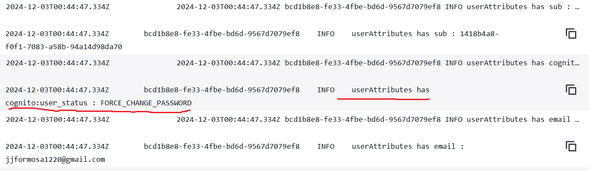
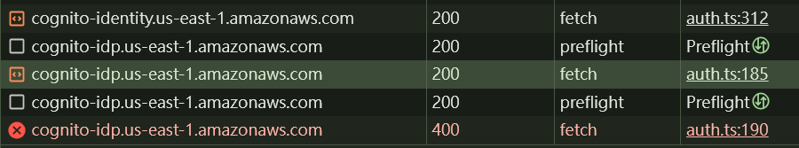
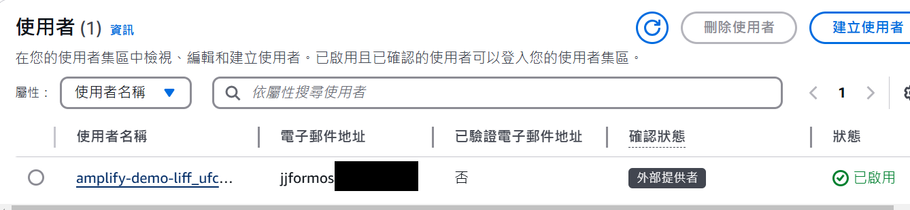
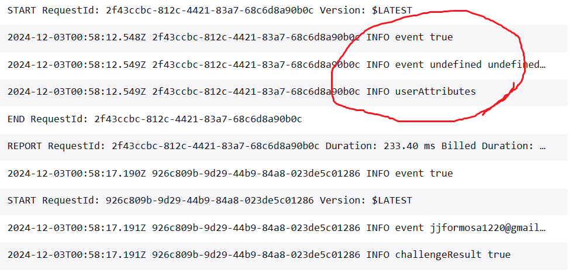
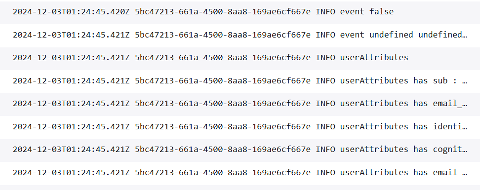
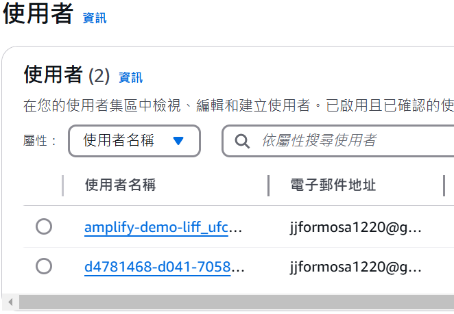

## 重大改變
從這章起我會將專案改為前後端分離兩個應用，也就是前面一再提到的，前端歸前端，後端龜Amplify，~~Typescript/React不夠熟，很容易build前端失敗讓我龜組火~~，這樣至少有三個好處:
1. 不需要因為前端畫面的更新，就進行一次版控和部署。
2. 之後有需要直接調用AWS，或者其他開源平台的資源，而不是Amplify的資源，內容相對好管理。
3. 解開部屬Amplify Backend、下載amplify_outputs.json，還是先寫前端程式碼的雞蛋問題。

目前的專案結構要解偶還算方便，由於當初~~我太懶~~ Amplify的CI上的指令是，當github source有更新main的時候，執行npm run build，而實際到*package.json* 一探amplify-react的範例
```json
......
"scripts": {
    "dev": "vite",
    "build": "tsc & vite build",
    "lint": "eslint . --ext ts,tsx --report-unused-disable-directives --max-warnings 0",
    "preview": "vite preview"
  }
......
```
可以知道npm run build實際上會執行tsc與vite build兩個部分，所以下一輪push時，把這邊改成只有做tsc，就只會做後端的更新了。

至於前端，寫一個新的腳本，如build:frontend處理vite build，往後在build:frontend結束後把dist資料夾壓縮起來，開一個新的Amplify應用程式，上傳壓縮檔就搞定了。
> dist就是一包靜態網站而已，也可以將其交給nginx、iis、s3、githubpage......任何你習慣的環境。

> 這其實還是蠻浪費code build的成本，因為tsc實際還是會花時間處理在src的內容，所以真正在用的時候還是建議徹底分開。

## 處理註冊
使用Cognito、Amplify的預設介面和流程的時候，新帳戶會自動實現註冊(甚至信箱認證)，但是如果是自己呼叫SignIn API，就要自己處理帳號不存在、註冊(SignUp)等工作了。

### 24/12/02 大修正
Day5 之前的程式碼

```typescript
// amplify/functions/defineAuthChallenge/handler.ts

...
else {
    const email = event.request.userAttributes.email
    // 代表本次請求來自某個Amplify Client的首次請求
    const filterParams = {
      UserPoolId: event.userPoolId,
      AttributesToGet: ['email'],
      Filter: `email = "${email}"`
    }
    // 確認email已經存在於userpool
    const listUsersResponse = await cognitClient.listUsers(filterParams).promise()
    const users = listUsersResponse.Users ?? []
    if (users.length === 0) { //這段會導致前端收到註冊要求，但Day4還先不處理
      event.response.issueTokens = false
      event.response.failAuthentication = true
    } else { //這段會觸發UserPool向前端發起挑戰
      event.response.challengeName = 'CUSTOM_CHALLENGE'
    }
  }
```
其實是沒有作用的，雖然AWS每一份關於自訂挑戰的文件都指出，可以在defineAuthChallenge取得clientMetaData與userAttributes，但經過兩天一夜的測試結果是:
1. 當帳號不存在(在我的case是email)，會在defineAuthChallenge收到以下具指標性的資料
```typescript
// amplify/functions/defineAuthChallenge/handler.ts
const { email, picture, name } = event.request.clientMetadata ?? {}  // {}
console.log('event', email, picture, name)                           // undefined, undefined, undefined
console.log('event', event.request.userNotFound)                     // true
...
const e = event.request.userAttributes.email                         // undefined
```
2. 當帳號存在
```typescript
// amplify/functions/defineAuthChallenge/handler.ts
const { email, picture, name } = event.request.clientMetadata ?? {}  // {}
console.log('event', email, picture, name)                           // undefined, undefined, undefined
console.log('event', event.request.userNotFound)                     // false
...
const e = event.request.userAttributes.email                         // email
```
重點: **這時候的userAttributes，其實是來自cognito內已經存在的使用者資料取得的，並不是Amplify Auth Client發出的內容。**

取得的userAttributes有不是程式碼送出的屬性



3. 但是defineAuthChallenge並不會觸發使用者不存在的錯誤，要一直到verfifyAuthChallenge才會收到相關錯誤
```typescript
// src/services/amplify/auth.ts
try {
    const payload = (decodeJWT(idToken).payload) as OIDCIdToken
    console.log(161, accesstoken, payload)
    const { email, name, picture } = payload
    if (!email) throw new Error('email is null')
    if (!name) throw new Error('email is name')
    if (!picture) throw new Error('email is picture')
    const username = email
    const clientMetadata = { identitySource : 'liff', email, name } // 這算是重點，寄望這個參數之後可以支援其他socail login的擴充
    const signInInput: SignInInput = {
      username,
      options: {
        authFlowType: 'CUSTOM_WITHOUT_SRP',
        userAttributes: {
          email,
          name,
          picture,
          'custom:liffId': payload.sub,
          'custom:liffAccessToken': accesstoken
        },
        clientMetadata
      }
    }
    const { isSignedIn, nextStep } = await signIn(signInInput)            // 這邊會通過
    console.log(181, isSignedIn)
    console.log(isSignedIn, nextStep.signInStep)
    if (nextStep.signInStep === 'CONFIRM_SIGN_IN_WITH_CUSTOM_CHALLENGE') {
      if (!payload.email) throw new Error('payload.email is null')
      const confirmSignInOutput = await confirmSignIn({                  // 這邊才會跳到exception
        challengeResponse: accesstoken,
        options: {
          clientMetadata
        }
      })
      if (confirmSignInOutput.isSignedIn) {
        console.log('aws cognito signin')
      } else {
        console.log(confirmSignInOutput.nextStep)
      }
      return { ...confirmSignInOutput }
      // const question = nextStep.additionalInfo!.question.split(',')
      // const challenge = formatChallenge(nextStep.additionalInfo!.question, redirectUri)
      // sendTextMessage(challenge)
      // return { isSignedIn, nextStep, question}
    } else {
      return { isSignedIn }
    }
  } catch (ex) {
    console.error(`doLoginWithLiff: ${ex}`)
    return { isSignedIn: false }
  }
```

看紀錄是400錯誤，並且可以指到真實程式碼行數



4. 如果有[啟用PreventUserExistenceErrors](https://docs.aws.amazon.com/zh_tw/cognito/latest/developerguide/user-pool-lambda-define-auth-challenge.html)，會導致即使被Cognito判定帳號不存在，client端也收到帳號密碼錯誤，AWS覺得這樣比較安全。
5. 本來上面的狀況沒甚麼，但接下來的情境相當魔幻，因為我們的練習過程，讓測試者可以提前用Cognito的登入介面完成登入和註冊，也會看到userpool裡面確實有結果



但是，defineAuthChallenge卻是userNotFound狀態



這時候如果把程式碼改成
```typescript
// src/services/amplify/auth.ts
try {
  ......
    const payload = (decodeJWT(idToken).payload) as OIDCIdToken
    const { email, name, picture } = payload
    const sub = payload.sub?.toLocaleLowerCase()
    const username = `amplify-demo-liff_${sub}`
    const clientMetadata = { identitySource : 'liff', email, name } // 這算是重點，寄望這個參數之後可以支援其他socail login的擴充
    const signInInput: SignInInput = {
      username,
      options: {
        authFlowType: 'CUSTOM_WITHOUT_SRP',
        userAttributes: {
          email,
          name,
          picture,
          'custom:liffId': payload.sub,
          'custom:liffAccessToken': accesstoken
        },
        clientMetadata
      }
    }
  ......
```

噹啦~~帳號就被找到了



這也是害我找了兩天一夜的元凶，**透過練習，external provider註冊的帳號，雖然也有開啟email登入，但真的用同一個email去登入時不會被當作同個帳號**，加上PreventUserExistenceErrors會對client隱藏server判斷帳號不存在，讓client的操作更難判斷。

6. 如果反過來，我們先用程式碼註冊，再使用外部登入者，也會得到類似的結果，這也許意味著，~~之後研究怎麼整合帳號更有價值了~~，每種登入提供者(SDK也算一種)，都要先假設他們是獨立的帳戶。



## Summary
1. External Provider的登入者，username是exteranl provider name_${可自訂}，且必須以該username作為帳號識別
2. 透過sdk建立的帳號，跟Exteranl Provider無關
3. authchallenge有自己判斷帳號是否存在的流程，可以在trigger檢查，或者等verifyChallenge處理檢查結果。
4. Cognito的使用email別名做登入、檢查，似乎只對SDK或手動建立帳戶有效。

因為篇幅感覺有點長了，怎麼處理signUp流程就下一章再繼續。