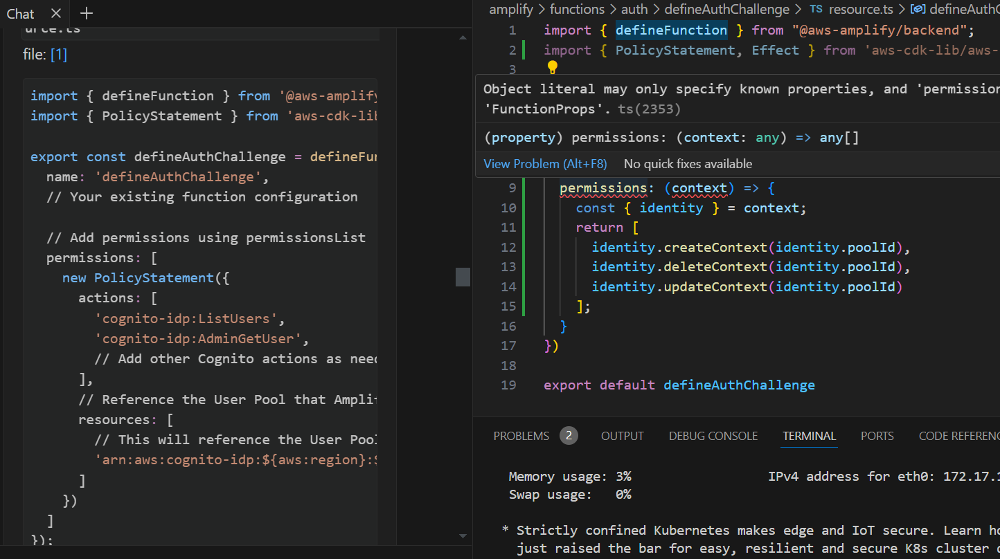
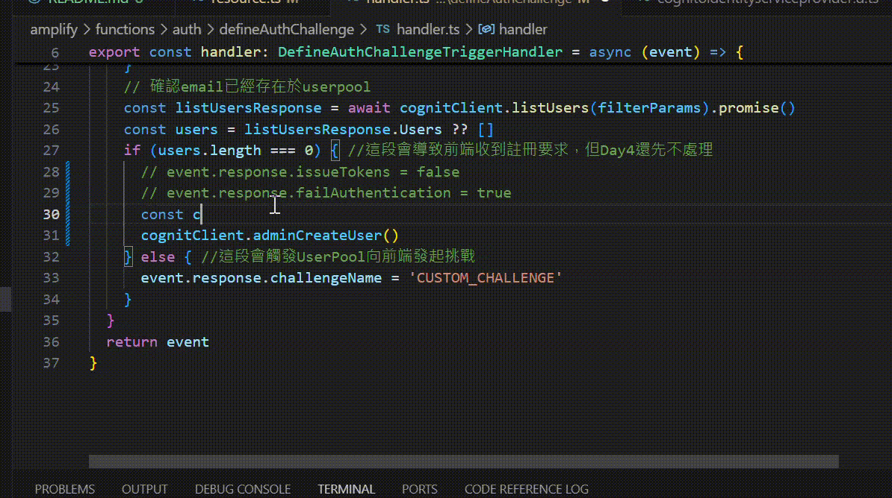

## 重大改變
從這章起我會將專案改為前後端分離兩個應用，也就是前面一再提到的，前端歸前端，後端龜Amplify，~~Typescript/React不夠熟，很容易build前端失敗讓我龜組火~~，這樣至少有三個好處:
1. 不需要因為前端畫面的更新，就進行一次版控和部署。
2. 之後有需要直接調用AWS，或者其他開源平台的資源，而不是Amplify的資源，內容相對好管理。
3. 解開部屬Amplify Backend、下載amplify_outputs.json，還是先寫前端程式碼的雞蛋問題。

目前的專案結構要解偶還算方便，由於當初~~我太懶~~ Amplify的CI上的指令是，當github source有更新main的時候，執行npm run build，而實際到*package.json* 一探amplify-react的範例
```json
......
"scripts": {
    "dev": "vite",
    "build": "tsc & vite build",
    "lint": "eslint . --ext ts,tsx --report-unused-disable-directives --max-warnings 0",
    "preview": "vite preview"
  }
......
```
可以知道npm run build實際上會執行tsc與vite build兩個部分，所以下一輪push時，把這邊改成只有做tsc，就只會做後端的更新了。

至於前端，寫一個新的腳本，如build:frontend處理vite build，往後在build:frontend結束後把dist資料夾壓縮起來，開一個新的Amplify應用程式，上傳壓縮檔就搞定了。
> dist就是一包靜態網站而已，也可以將其交給nginx、iis、s3、githubpage......任何你習慣的環境。

> 這其實還是蠻浪費code build的成本，因為tsc實際還是會花時間處理在src的內容，所以真正在用的時候還是建議徹底分開。

## 處理註冊
使用Cognito、Amplify的預設介面和流程的時候，新帳戶會自動實現註冊(甚至信箱認證)，但是如果是自己呼叫SignIn API，就要自己處理帳號不存在、註冊(SignUp)等工作了。

```typescript
// amplify/functions/defineAuthChallenge/handler.ts

...
else {
    const email = event.request.userAttributes.email
    // 代表本次請求來自某個Amplify Client的首次請求
    const filterParams = {
      UserPoolId: event.userPoolId,
      AttributesToGet: ['email'],
      Filter: `email = "${email}"`
    }
    // 確認email已經存在於userpool
    const listUsersResponse = await cognitClient.listUsers(filterParams).promise()
    const users = listUsersResponse.Users ?? []
    if (users.length === 0) { //這段會導致前端收到註冊要求，但Day4還先不處理
      event.response.issueTokens = false
      event.response.failAuthentication = true
    } else { //這段會觸發UserPool向前端發起挑戰
      event.response.challengeName = 'CUSTOM_CHALLENGE'
    }
  }
```
我們要處理的是上面的程式碼中的情境，另外提一下
> 必須賦予這個lambda相對應listUsers on UserPool(Cognito)的permission，目前我都是手動處理，還沒有找到在amplify/auth/resources上面處理的方法，雖然Amazon Q覺得有，如果有人知道方法還請交流



其實也可以使用上面的程式碼，讓前端自己決定要不要自動完成註冊動作(可以參考/src/services/amplify/auth.ts, doRegisterByLiff的部分)，實際上我自己也是採用這個方法，以免客戶有需要做額外的UX，所以為了~~採坑~~ 練習，這邊我就刻意試著修改defineAuthChallenge，直接用AWS sdk註冊使用者。

