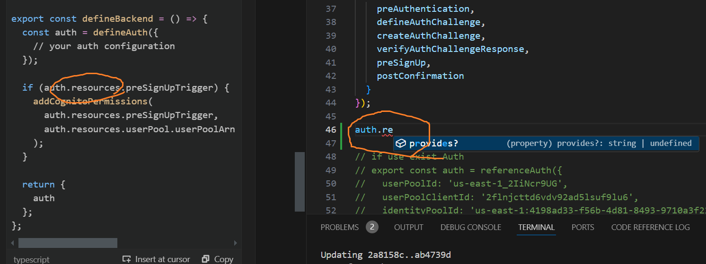
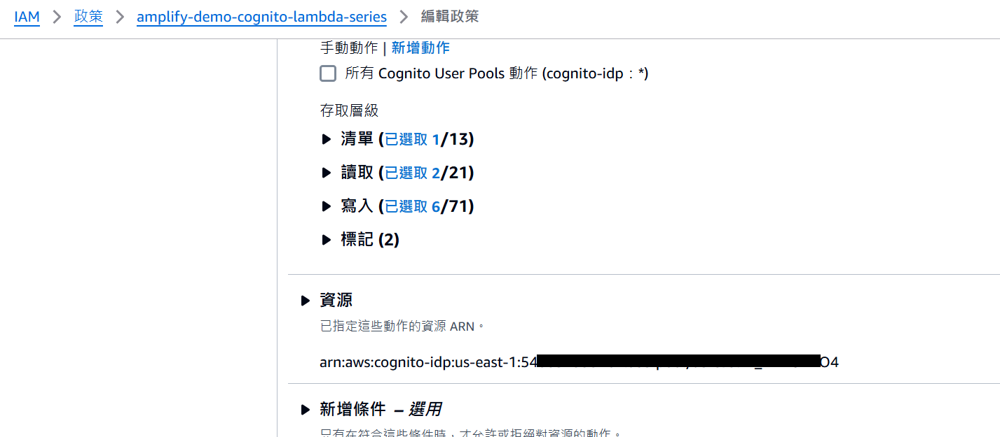

## 回顧
前一篇我們的困境是:
1. Exteranl Provdier完成註冊後，跟SDK/手動註冊的體系不同帳號
2. 如果先完成Exteranl Provdier註冊，需要以username才能分辨帳號
3. 但我們沒辦法組織所有的username的可能，再一個個打SignIn測試，舉例來說，若使用者之前是用FB登入，實際的識別需要用fb_${fb_sub}，雖然使用者使用google登入的時候，我們也可以用fb_的prefix去搜尋，但是這時候沒有fb_sub可填。
4. 如果找不到Username，challenge沒辦法取得attributes跟clientmeta，所以我們也沒辦法從前端提供參數給trigger使用。

其實認真說只有4.是問題就是了，所以眼下我們有三個解法
1. 雖然challenge無法使用client的參數，但終究會有登入失敗，還是可以在lambda trigger throw 特定的exception message讓前端知道下一步需要註冊。
2. 另外開一個API，登入前先用adminListUser掃帳號，再決定下一步。但安全地使用Amplify客製化的API，我打算後面章節再說明，已經很熟係的人可以考慮優先這樣處理。但有另一個隱患是，Cognito都已經特地隱藏帳號不存在了，又去開這支API感覺有點破壞設計原則。
3. 實作preAuth、preSign和confirmPost，接走External Provider的處理。

我最初的想法其實很簡單，在[preSign事件](https://docs.aws.amazon.com/zh_tw/cognito/latest/developerguide/user-pool-lambda-pre-sign-up.html)將userName改為email就好，但這樣只會導致外部供應商連註冊帳號都沒辦法成功，而如果改為[完全用程式碼控制](https://docs.amplify.aws/react/build-a-backend/auth/advanced-workflows/#identity-pool-federation-3)，感覺又失去了一點味道。

## 試看看AI
Amazone Q其實讓我失望了不少次，包括他對userAttributes的說明只讓我多繞了幾圈，但他這次的意思是AdminLinkProviderForUser就是for這個用途的，[看文件似乎也有這麼一回事](https://docs.aws.amazon.com/AWSJavaScriptSDK/v3/latest/client/cognito-identity-provider/command/AdminLinkProviderForUserCommand/)，總之也不麻煩就試試看吧，程式碼可以切到Day6分支，看amplify/functions/auth底下的幾隻檔案，關鍵大致在於
```typescript
 if (listUsersResponse.Users && listUsersResponse.Users.length > 0) {
      const existingUser = listUsersResponse.Users[0];
      
      // Get provider info from the incoming user
      const [providerName, providerUserId] = event.userName.split('_');
      
      // Link the new social provider to existing user
      await cognitoClient.send(new AdminLinkProviderForUserCommand({
        UserPoolId: event.userPoolId,
        DestinationUser: {
          ProviderName: "Cognito",
          ProviderAttributeValue: existingUser.Username
        },
        SourceUser: {
          ProviderName: providerName,
          ProviderAttributeName: "Cognito_Subject",
          ProviderAttributeValue: providerUserId
        }
      }));

      // Prevent creating new user
      throw new Error("User already exists and has been linked");
    }
```

測試以後發現，這次它還真的對極了，只剩下一個坑，實際場景非常容易撞到一個errormessage:**Merging is not currently supported, provide a SourceUser that has not been signed up in order to link**，從字面上的意思看，當作為SourceUser的帳號已經存在，就不能被Link了，這也難怪Amazon Q的範例是在AdminLinkProviderForUser後做throw。從preSign的角度看這倒不是甚麼太大的問題，能創造的體驗也很多，例如:
1. 不存在email/password的帳號，就先用adminCreateUser
2. 直接throw但把External Provider的資料暫存到NoSQL，前端要求使用者先填寫註冊表單
3. 在使用者首次用密碼登入或忘記密碼的時候，才做資料遷徙
4. 維持不同帳號存在，直到活動在做資料清理與遷徙
當然我不可能全都實作出來，而我的短期目標其實是*讓使用者有一個身分可以接受跨平台的訊息*，例如接受line的留言和加入好友通知、來自FB的關注通知、使用GoogleMeet、Clander甚至email功能排班，甚至來自trello、github、DC......等等的通知，都可以用一個身分去整合、執行業務，而且管理者很容易轉移身分到其他同事身上。

乍想之下，實現上面的目標，光靠第一個解方就夠了，故這個專案也暫時先用這樣，日後如果發現甚麼不足的部分再作處理。最後再附上AWS CLI版本AdminLinkProviderForUserCommand指令，這樣要驗證資料比較方便，不用一直部署(燒錢)
```sh
aws cognito-idp admin-link-provider-for-user \
--user-pool-id <userpoolId> \
--destination-user ProviderAttributeValue=<dist-userName>,ProviderName=Cognito \
--source-user ProviderName=<external provider name>,ProviderAttributeName=Cognito_Subject,ProviderAttributeValue=<sub from OIDC> \
--profile <aws profile name>
```

## 麻煩但又好用的permission
這邊必須提醒，要讓Lambda Trigger可以幫忙處理上面的邏輯，必須給予該Lambda對應的Permission，而我到目前還沒找到在Amplify的resources中直接賦予policy或者permission的方法，如果有觀眾知道怎麼作還請告知

Amazone Q也沒有正確解答



記得給權限給最小範圍的資源就好，畢竟這是帳號管理，一弄亂就很難處理



<!-- TODO
比較LambdaTrigger可以收到的參數
-->