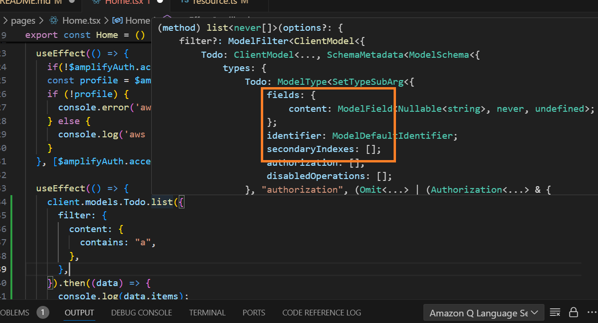
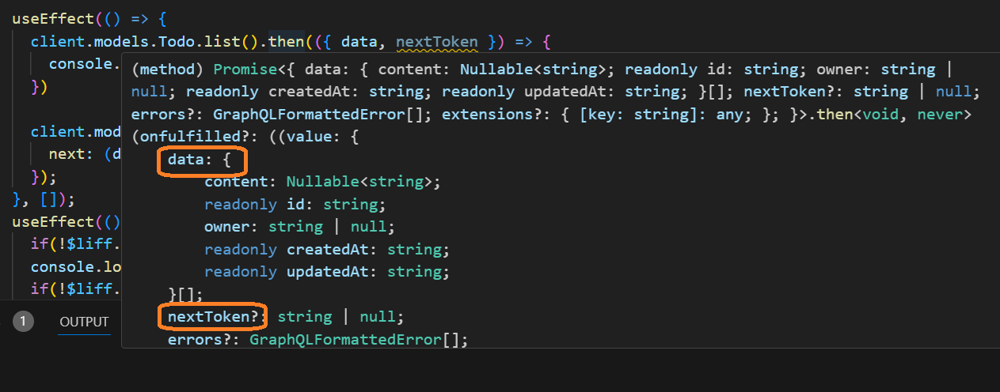

在上一篇嘎然而止的原因其實是因為Amazon Q的建議需要DynamoDB、IAM與Lambda知識，所以先來介紹這些工具。

## 管理資料
DynamoDB是由AWS託管的NoSQL(Document)的資料庫，但相較於知名的MongoDB，它有一些不便、複雜的地方，大概會需要2~3篇介紹。

React的範例已經有資料的範例了
```typescript
// src/data/resource.ts
const schema = a.schema({
  Todo: a
    .model({
      content: a.string(),
    })
    .authorization((allow) => [allow.publicApiKey()]),
});

export type Schema = ClientSchema<typeof schema>;

export const data = defineData({
  schema,
  authorizationModes: {
    defaultAuthorizationMode: "apiKey",
    // API Key is used for a.allow.public() rules
    apiKeyAuthorizationMode: {
      expiresInDays: 30,
    },
  },
});
```

這段簡短的程式碼吸睛的部分有兩個，一個是以文件定義NoSQL的結構，一個是簡潔的定義資料的存取權的方法。如以下，很輕鬆地就可以把使用者之間隔離，但admin身分的帳號仍然可以協助管理帳號，[權限的細節](https://docs.amplify.aws/react/build-a-backend/data/customize-authz/)不難理解，可以閱讀官方文件加強就好。
```typescript
const schema = a.schema({
  Todo: a
    .model({
      content: a.string(),
    })
    .authorization((allow) => [
      allow.owner().to(['create', 'read', 'update', 'delete']),
      allow.groups(['admin'])
    ]),
});
```

這邊要提醒DynamoDB我覺得最不友善的部分:index和sortkey的使用，必須在schema階段就定義，sortkey還可以再晚一點，但是透過AWS CLI或WebConsole定義的，就不能直接透過Amplify Client使用了。然後，index跟sortkey又往往牽扯到id、created和updated三個預設欄位，這三個是沒定義在resource，仍然會自動出現的資料


接下來，習慣RDS的開發者會遇到幾個問題
1. 使用DynamoDB Client的method時會發現，不像RDS可以隨時下sort或paging指令(order by, offset, limit等)，如下圖是amlify/data的Client提供的list功能的參數，只有field(篩選欄位，讓回傳資料瘦身)、identifier(等同get單一比資料)和SecondaryIndex可以使用



然後在AWS Web介面上，有這麼一個畫面，藏的有點深
1. 在DynamoDB左側選擇探索項目>找到你要操作的資料表
2. 仔細找一下，會有一個掃描或查詢區塊，預設有可能是收斂的，把它打開才會有以下畫面


切到查詢，如果一開始有設計SecondaryIndex，在圖上標1.的地方可以下拉選擇，然後會看到區塊2.可以選擇大於等於條件，區塊3.可以選擇倒序

3. 對照Amplify關於[Secondary Index的文件](https://docs.amplify.aws/react/build-a-backend/data/data-modeling/secondary-index/)應該會比較理解這一切該怎麼運作:如果你希望可以依照某個條件*排序，需要事先做好規劃*。

4. 另外，如果你也習慣用page/offset, length/limit......之類的query statement，因為Amplify Data Client背後是AppAsync這個功能，它本來的用途是把支援的DataSoruce轉為GraphQL介面，所以每次查詢的結果會得到一對data和nextToken，要繼續拉資料，需要帶入上一次得到的nextToken，如果nextToken為null，會當作重新從頭拉資料。ChatGPT說GraphQL這種風格叫Cursor-Base Pagination，與之相對的是Offset-Base Pagination，接下來也會姑且這樣分別稱呼它們!



5. 另外，也許會你也會覺得一個Amplify應用程式，就要在DynamoDB開一堆類似instance的資料庫，似乎很可怕。其實AWS有一套在DynamoDB的規劃建議[^1]，但個人覺得很難在前期規劃、驗證階段執行，故附在註腳就好，但閱讀該文章，對於需要先設計key與Secnodary Index(sort key)會有幫助。

6. 然後話題要回到id, created, updated這三個預設欄位上

### 系統預設有，但想作為Secondary Index，需要自己定義、並且賦值
就是這麼麻煩，因為太麻煩了我就不提供沒這麼做的話，會有甚麼錯誤的畫面，有興趣的觀眾再自己微調程式碼試試看。總之當前(branch Day9)的程式碼，能提供你
1. 只能CRUD自己的專屬的資料
2. 可以依照建立日期搜尋自己開的TODO清單

[^1]:[DyanmoDB的Secondary Index設計](https://docs.aws.amazon.com/amazondynamodb/latest/developerguide/GSI.html)，實際上是NoSQL(Document)資料如果要整合多張表，怎麼設計，大致都在這篇文中了