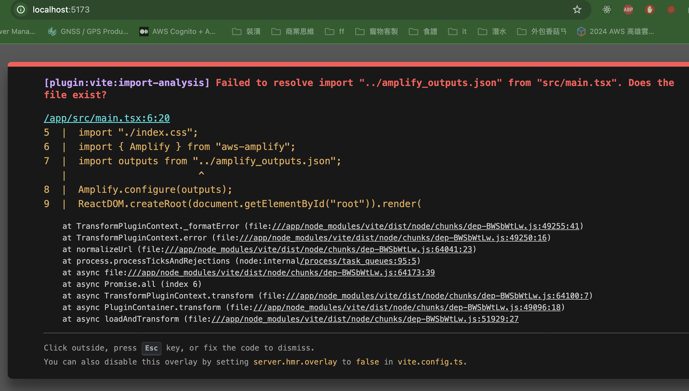

## run it, first
我的部署環境是AWS，開發語言基於Facebook的React，以及姑且可以稱Google開發的NodeJS(V8)，用蘋果電腦開發，還可以遇到什麼問題？最大的問題出在arm64(M1)，在執行一卡車安裝指令的時候常常失敗，或者，更現實的問題，在公司我需要協助、維護同事的程式碼的時候，同事跟我的開發版本不一樣，但是因為我的電腦上需要維護很多份程式碼，甚至AWS CLI也有依賴到Node版本，所以不見得方便切換Node版本。

## with Docker
幸好有Docker，可以讓我們依照專案指定rebuild用的版本，但那Docker本身搭配m1晶片，build出去的image常常沒辦法在第一時間跑起來，畢竟通常大家都是基於amd64，只有M系列是arm64，因此要特別注意，若你也是尊貴不凡的M晶片，記得習慣性給自己的docker加上 --platform=amd64，以下是我通常使用的Dockerfile(Dockerfile.dev)，用來產生開發環境的image:

```Dockerfile
FROM --platform=amd64 node:22.3-alpine
WORKDIR /app
COPY . .
EXPOSE 5173

ENTRYPOINT [ "sh" ]
CMD ["dockerscripts/dev-install.sh"]
```
如果你打開專案中的dev-install.sh，會發現該腳本沒什麼大不了的，也就是*npm install*和*npm run dev*而已，頂多加上支援輸入變數、判斷node_modeule是否存在，那麼為什麼不在Dockerfile撰寫*RUN npm install* 和 *CMD ["npm", "run", "dev"]*就好呢？這是因為這時候我的目標是製作「開發用的環境」，接下來搭配的指令(rundev.sh)如下
```sh
#!/bin/bash
img_name="amplify-dev:node-22-alpine"
port_num=5173

# 解析參數
while [ $# -gt 0 ]; do
  case $1 in
    --img_name=*)
      img_name="${1#*=}"
      ;;
    --port_num=*)
      port_num="${1#*=}"
      ;;
  esac
  shift
done

docker run -itd -p $port_num:$port_num -v .:/app -w /app "$img_name"
```
需要注意的是，因為這時候在開發，依然在變更檔案，所以實際上的需求是將專案資料夾，掛到一個指定的執行環境(container)裡面，那麼如果在第一次build image的過程中執行*npm run install*，等到專案資料夾第一次binding container，還不具有node_modules的專案資料夾就會把工作目錄*app* 已經安裝好的環境又蓋過去，當然，你也可以透過更複雜的腳本，在容器中其他資料夾install後再把node_modules移動到工作目錄，但相較之下我覺得目前這樣簡潔一點。以上issue，你可以改使用專案中的Dockerfile.devissue打包image，看看結果的不同。

## so go on
AWS Amplify的部分先姑且放下，這個專案是基於[Amplify React Template](https://docs.amplify.aws/react/start/quickstart/#make-frontend-updates)繼續寫下去的，既然是React，他就應該要能先讓我們在本機端看到畫面，檢查**package.json**，也會看到前端或者NodeJS的工程師熟悉的指令
```json
"scripts": {
  "dev": "vite",
  "build": "tsc && vite build",
  "lint": "eslint . --ext ts,tsx --report-unused-disable-directives --max-warnings 0",
  "preview": "vite preview"
}
```
但在container順利執行腳本後，也看到log中那令人振奮的畫面了

可是瀏覽器卻有可能連接不上，只有令人心碎的畫面

這是因為，在Container中的Node環境，就只接受一樣來自它的localhost來源請求，而開發機上的瀏覽器相較於Container是**另一台機器**，這是我在工作上常遇到同事剛開始接觸Docker的時候相對常見的問題，包括
- 在開發機上，執行指令後可以透過localhost打開網頁，用了Docker就不行
- 在Docekr中的程式碼連不到另一個Docker，或者開發機上的資料庫
- 總之就是各種連線失敗
這一類問題，其實Google或者透過ChatGPT，都有人/AI說明得很清楚了，就不在這邊野人獻曝，總之現在需要把專案中的腳本調整一下，從 *\"dev\":\"vite\"* 改為 *\"dev\":\"vite --host 0.0.0.0\"* ，然後把前次操作生成的Container刪掉，重新執行 *dockerscripts/rundev.sh*，這下瀏覽器就有收到回應啦!!


## just another day in life of dev 
來自客戶、或者主管、同事，有時候是KOL，有時候大公司們一句右一句動聽的話語，變成開發者一個又一個要克服的困難，然而我覺得整合這些，則是「開發」在IT行業獨特的地位的原因之一，而且近年的開發者，在自己的機器上就可以體驗、排除過整合環境的困難，其實就職涯來說我並不覺得全然是個壞事。
另一方面，興奮起來吧！從錯誤中我們可以看到是因為少了一個*amplify_outputs.json*檔，這是其中一個選擇AWS Amplify的原因，作為一個相對老的開發者，這個檔案讓我們聯想到的是像firebase message，或者諸如此類服務需要下載，並且放到專案中的檔案，不論是網站、Android或者iOS都需要它，但，回到(AWS文件)[https://docs.amplify.aws/react/start/quickstart/#4-set-up-local-environment]，這個json檔的來源，跟開發者透過整個AWS Amplify維護後端服務有關，也就是說有那麼一個機會，透過這個檔案與Amplify跨平台的SDK，可以讓Amplify支援的每個平台，包括React(含Next)、Vue、Angular、Flutter、Android與iOS(Swift)，都可以使用同一份文件，實現功能的串接。
但遺憾的是有個大前提， **後端目前只有Node**。雖然對於我這類支持前後端一個語言的開發者來說，這是一份獎勵就是了。總而言之，依照文件的提醒，我們需要先部署Amplify，取得amplify_outputs.json檔案，才能讓網站順利跑起來。請特別注意，透過CI/CD開始需要費用，以及AWS帳號、專案，也需要版控平台，基本上還要AWS CLI跟AWS SDK，這些基本要求都不在這邊提了，下一張圖就是完成以上工作後的結果。


## TODO
### 延伸閱讀
關於開發機器上，環境落後的案例
